\newpage

\begin{center}
\includegraphics{./pictures/CaRpools.png}
\end{center}


\newpage

```{r loadlibs, echo=FALSE, error=FALSE, warning=FALSE, message=FALSE, include=FALSE}
if("caRpools" %in% rownames(installed.packages()) == FALSE) {install.packages("caRpools")}
  library(caRpools,warn.conflicts = FALSE, quietly = TRUE,verbose =FALSE)
load.packages()
data(caRpools)
```


# Introduction

The **CaRpools** (**C**RISPR **A**nalyze**R** for **Pool**ed **S**creens) package allows users to analyze raw NGS read count data from pooled CRISPR Screens in an end-to-end fashion and serves as a basis for creating customized reports for more advanced users.  
These pooled screens must contain lentivirus-based libraries as they can be obtained via [Addgene](https://www.addgene.org/CRISPR/libraries/) e.g. .
It provides functions to create different quality control plots, normalize the data, compare the data and perform hit identification via three different methods.  
Furthermore it can be used to completely analyze the date in a streamlined workflow with the provided analysis template.  

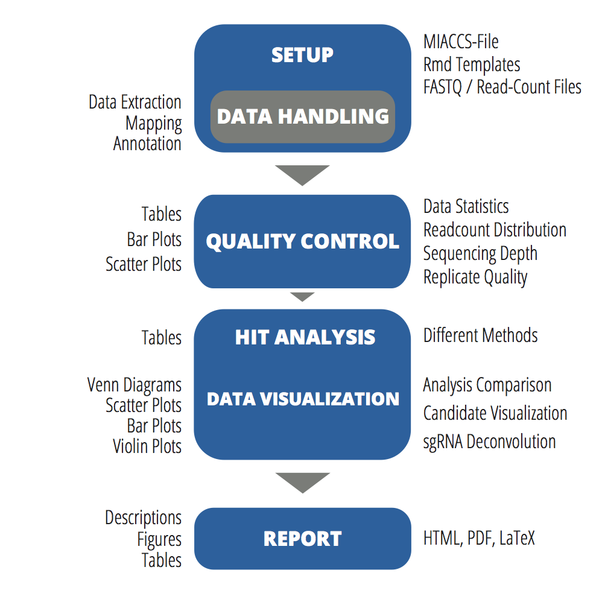

With **CaRpools**, the user can analyze pooled CRISPR/Cas9 screens end-to-end in a standardized fashion allowing for reproducible data analysis.  
This includes:  

* FASTQ data extraction (optional)
* Mapping against a reference library FASTA file using bowtie2 (optional)
* Extract Mapping data and convert it into read count files (optional)
* Generate quality control plot
* Generate data set statistics
* Perform hit analysis using three different methods
* Visualize hit candidates
* Compare hit analysis for most robust hit identification
* Retrieve information about single sgRNAs for hit candidates
* Generate standardized reports, which can be customized (for advanced users)

\newpage

## Download caRpools

CaRpools is available as an R package **caRpools** without the scripts and template files.  
The complete package with the PERL scripts and all template files can be obtained from [Github](https://github.com/boutroslab/carpools) (https://github.com/boutroslab/carpools) and our website [CRISPR-AnalyzeR.de](http://www.crispr-analyzer.de).  

We recommend to download the template files and Scripts from Github and install caRpools in R using the package installer `install.packages("caRpools").

## Quality Control

Available Quality Control plots include (for sgRNAs or summarized for genes):  

 * Read-count Distribution `carpools.read.distribution`
 * Read Depth `carpools.read.depth`
 * sgRNAs present per Gene Target `carpools.reads.genedesigns`
 * Read-count Overview per sgRNA / Gene `carpools.read.ballmap`
 * Read-count comparison of different samples `carpools.read.count.vs`
 * Read-count / Fold-change of sgRNAs for single genes `carpools.raw.genes`
 
## Annotation

Since several gene identifiers are used for generating CRISPR pooled KO libraries, e.g. EnsemblID,  
loaded data-sets can automatically be annotated with further gene annotation like official gene symbol or descriptions  
using the `biomaRt` interface.  
More details can be found below in the section of `get.gene.info` or via `?get.gene.info` / `?biomaRt`.  

## Gene Read Count Data or Removing Gene Data

Furthermore, sgRNA read-count data can be aggregated (summed up) to corresponding genes `aggregatetogenes` or gene data can be excluded for the analysis using `gene.remove`. 
 
## Hit Analysis

Moreover, this package can be used to identify screening hits using either
 
 * DESeq2 `stat.DESeq`
 * Wilcox-based hit calling `stat.wilcox`
 * MAGeCK `stat.mageck`
 
and hit calling / data analysis can be compared between all the methods with `compare.analysis` or `carpools.hit.overview`.
Finally evaluated data analysis can be visualized in different ways with `carpools.hitident` for all methods listed above.

## sgRNA Information

Moreover, you will also be provided with in-depth information about the sgRNAs of your genes.  
These can be derived from `carpools.raw.genes` for any gene or `carpools.hit.sgrna` for your hit candidates in an automated way.  

## Report

All this data can be used to automatically generate a standardized report using the provided R Markdown template file including all plots and tables for you data analysis.  
Two different templates are provides:

* A standard report for generating short, brief data analysis
* An extended report with additional plots and tables

The R Markdown templates provide the user with the ability to generate HTML output as well as PDF output (LATEX installation necessary) including high-quality plots.  

__Provided PDF templates:__

* CaRpools-PDF.rmd
* CaRpools-extended-PDF.rmd

__Provided HTML templates:__  

* CaRpools-HTML.rmd
* CaRpools-extended-HTML.rmd
 
\newpage

# Requirements and Installation

## Virtual Box Image

We also included a Virtual Box Image that already includes all necessary software and package files.  
You just need to install Virtual Box 5 from the [Website](https://www.virtualbox.org).  

You can download the caRpools virtual box image from our website [crispr-analyzer.de](http://www.crispr-analyzer.de) or [Github](https://github.com/boutroslab/carpools) (https://github.com/boutroslab/carpools).  

### How to use the Virtual Box caRpools

Please see the [VirtualBox tutorial](https://github.com/boutroslab/caRpools/blob/master/docs/CaRpools-SHORTGUIDE-VirtualBox.Rmd) for instructions.  

## Download caRpools

CaRpools is available as an R package **caRpools** without the scripts and template files.  
The complete package with the PERL scripts and all template files can be obtained from [Github](https://github.com/boutroslab/carpools) (https://github.com/boutroslab/carpools) and our website.  

We recommend to download the template files and Scripts from Github and install caRpools in R using the package installer `install.packages("caRpools").

## Hardware Requirements

For CRISPR-Libraries of 12 K size (12K sgRNAs), caRpools will work on any laptop/PC with at least 4GB of RAM and a modern dual-core CPU.  
CRISPR-Libraries with a size of more than 100 K (100 K sgRNAs) run best with at least 8 GB of RAM.

## Software Requirements

CaRpools was tested on MacOSX Yosemite and Ubuntu 14.04 LTS.  
However, it should work on any operating system that fulfills the software requirements.  

The following software needs to be installed:

* PERL 5
* Bowtie2 2.2.0 or higher [Website](http://bowtie-bio.sourceforge.net/bowtie2/index.shtml)
* MAGeCK 0.51 (password protected download) [Website](http://sourceforge.net/p/mageck/wiki/Home/)
* TexLive [Website](https://www.tug.org/texlive/)
  + pdflatex
  + xelatex
* R 3.2.0 or higher [Website](https://www.r-project.org/)
* Pandoc 1.15.0.6 [Website](http://www.pandoc.org/)
* R-Studio [Website](http://www.rstudio.com) (GUI)

The following **R packages** need be installed (can be done via `load.packages()`):

* Bioconductor Basics
    + BiocInstaller >= 1.18.3
    + BiocGenerics >= 0.14.0
* __biomaRt >=2.24.0__
* seqinr >= 3.1-3
* xlsx >= 0.5.7
  + rJava >= 0.9.6
  + xlsxjars >= 0.6.1
* stringi >= 0.5
* scatterplot3d  >= 0.3
* MESS >= 0.3
* DESeq2 >= 1.8.1
* rmarkdown >= 0.7
* knitr >= 1.10.5
* VennDiagram >= 1.6.9
* sm >= 2.2

## BiomaRt and Annotation Requirements

__Please note that for any annotation, biomaRt needs full access to the internet.__
In case of incorrect proxy settings, the report generation will fail with a biomaRt error.  
This means that if any proxy server is used, this has to be configured before using caRpools as described in the following articles:  

* [BiomaRt vignette](http://www.bioconductor.org/packages/release/bioc/vignettes/biomaRt/inst/doc/biomaRt.pdf)
* [Setting up proxy in R-Studio](https://support.rstudio.com/hc/en-us/articles/200488488-Configuring-R-to-Use-an-HTTP-Proxy)
* [Setting up proxy in R, Stackoverflow](http://stackoverflow.com/questions/6467277/proxy-setting-for-r)
* [Setting up Proxy for R/R-Studio in Ubuntu](http://askubuntu.com/questions/572722/setting-up-the-proxy-for-rstudio)
* [Configuration of Proxy for R](https://bhoom.wordpress.com/2013/05/27/configuring-r-to-use-an-http-proxy-faq-knowledge-base-rstudio-support/)

## Installation Procedure

Install all software listed above according to the installation information stated on the software website.  
All necessary R packages can be installed automatically by `load.packages()`.

## Dataset / Screening Requirements

Since CaRpools fosters reproducibility of CRISPR/Cas9 screens, the following requirements for pooled screening data __must be fullfilled to analyze data__:

* Two biological replicates of _untreated_ sample data
* Two biological replicates of _treated_ sample data

**By default, _TWO_ replicates per condition are used by the templates provided. If you want to analyse more than two replicates per group, please have a look at _Providing more than two replicates_ . **  

## Files that can be loaded

The following files are required for data analysis:  

__Either__  
* NGS FASTQ file for each sample
* Library reference in FASTA format

__or__  
* Final read count file for each sample
* Library reference in FASTA format

CaRpools accepts either FASTQ files or read count files for each sample.
FASTQ file are then extracted and mapped using Bowtie2 against the library reference. Finally, read count files for each sample are generated.  

As an alternative, these final read count files can be provided as well, so that no extraction or mapping is necessary.  
In addition, a library reference file in FASTA format is necessary, usually this is the file that was used for ordering custom oligo libraries.  

File structures are shown below.

### Structure of NGS Readcount Data

General information about the FASTQ file format can be obtained in an easy-to-understand article from [Wikipedia](https://en.wikipedia.org/wiki/FASTQ_format).

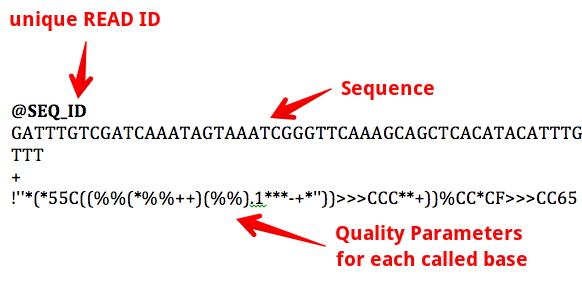

__maschine.pattern__  
The machine pattern used for extracting the sequences is a regular expression to identify the read ID including your sequencing machine.  
in the case of the above sample, the PERL regular expression used must be __M01100__.

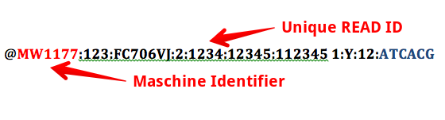

### Extraction Pattern

CaRpools extracts the integrated DNA sequence of your target sequence as a DNA barcode.  
In order to extract this sequence, a __PERL regular expression__ pattern is used to identify the desired nucleotide sequence, which is called __seq.pattern__.  

As an example, part of a U6 promoter-driven sgRNA cassette is given as follows:  

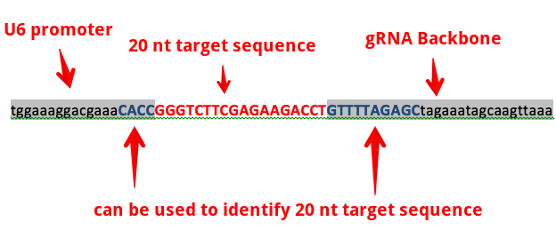

Since we want to extract the target sequence, the regular expression will use a part of the U6 promoter and a part of the sgRNA backbone to identify the target sequence.

CACC __(.{20})__ GTTTTAGAGC  

The parenthesis are necessary to extract the target sequence, for more information please see [RegExR](http://www.regexr.com/).

### Structure of FASTA Library Reference File

The library reference file must be in FASTA format and include ALL sgRNAs present in the data-set with exactly the same naming.  
e.g.

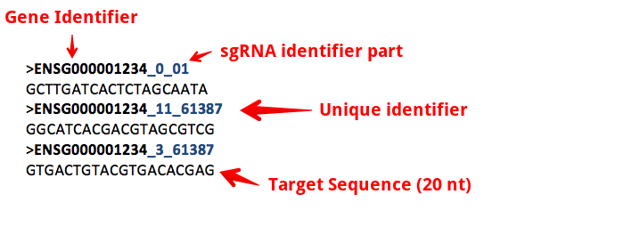


### Read-Count Data Files

CaRpools also takes read count files. If FASTQ files are provided and extracted/mapped with CaRpools, read count files will be created for each sample.  
Data for each sample must be formatted in a **tab-separated** way as follows:

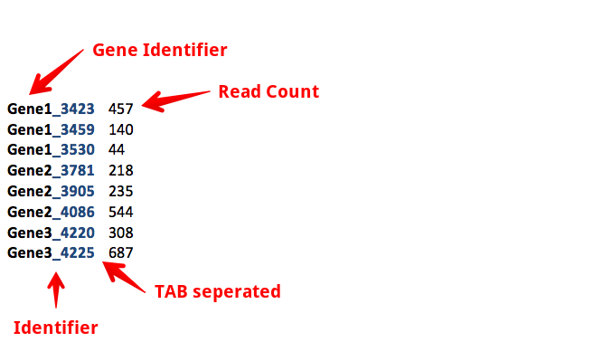

As shown in the above file, __Gene1__ is the Gene identifier, **_3423** is a unique part for identification of this sgRNA for the given gene and *Gene1_3423* is the whole identifier which uniquely identifies this sgRNA within the data-set.  

The name of each complete sgRNA **must** contain the gene it refers to either as gene symbol or any other identifier which shares the same separator in addition to a part of identifier that is unique for each sgRNA for that gene.  
The name can therefore be anything, as long as the *identifier is the same for each gene* and the *separator is the same for all data*.  

In principle a sgRNA identifier must consist of a **gene identifier**, followed by a **seperator** (e.g. _ or -) as well as a *secondary* **sgRNA identifier**. 

**Please note:**  
* Read counts MUST be numeric only.
* Within the sgRNA/Gene identifer, no special characters *except for _ and -* are allowed!


### File Loading

Files can be loaded via `load.file(filename, header, sep)` with the following arguments

* filename: the filename as character
* header: TRUE / FALSE , whether a header is used (as it is for the above sample)
* sep: the separator, default is `\t` for tab-separated files.

**Please see `?read.table` for a detailed description of the arguments.**

## Files and Folder Structure to use CaRpools

__Please note: the MAIN FOLDER must be the R working directory!__  
Data and Script paths can be adjusted in the MIACCS file.

The following files are necessary to use CaRpools for report generation:  

**MIACCS.xls**  
Minimum Information About CRISPR/Cas Screens.  This file needs to be filled out to provide all necessary information about the screen.  

**R Markdown Template files**  
Either CaRpools-extended-PDF.rmd, CaRpools-PDF.rmd or CaRpools-extended-HTML.rmd or CaRpools-HTML.rmd. Is the template for report generation.  

**Data Files**  
Two replicates (or more) per Control and Treated. Can be FASTQ files OR already mapped, not normalized read count files.  

**CRISPR-mapping.pl**  
PERL script to map your extracted FASTQ files, if desired (as indicated in the MIACCS.xls)  

**CRISPR-extract.pl**  
PERL script to extract 20 nt target sequence from FAST files, if desired (as indicated in the MIACCS.xls)  

**CaRpools.png**  
The logo file  

The following files are necessary to use _single_ CaRpools functions:  


**Data Files**  
Either raw read count files or FASTQ files (that need to be extracted and mapped using CaRpools)  

Please note that CaRpools always starts with loading data files. For raw-read-count files, use `load.file`. For FASTQ files, please see the sections below.

\newpage

__CaRpools folder structure for Report Generation using raw Read Count files:__  


\newpage

__CaRpools folder structure for Report Generation using raw Read Count files AFTER REPORT GENERATION:__

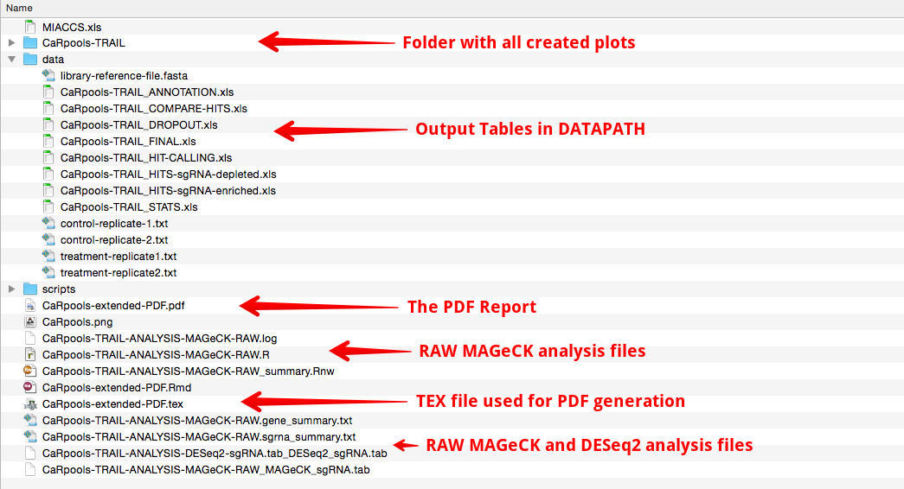

\newpage

__CaRpools folder structrue for Report Generation using FASTQ files:__  

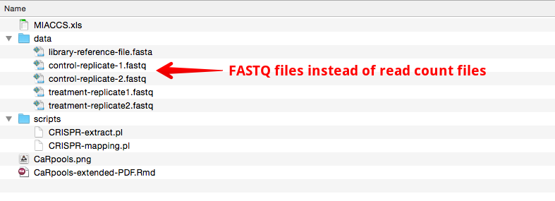

\newpage

__CaRpools folder structure for Report Generation using FASTQ files AFTER REPORT GENERATION:__

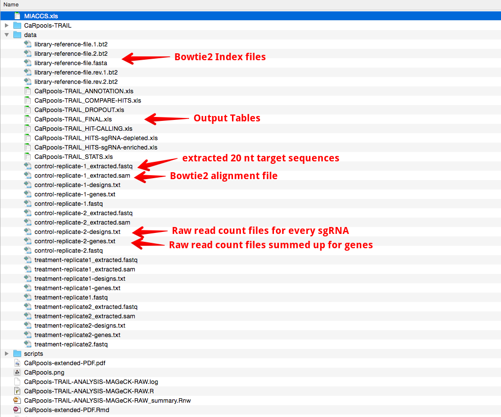


\newpage

# Using CaRpools with Provided R Markdown Templates

By default, CaRpools is meant to be used to generate standardized reports of CRISPR/Cas9 pooled screenings using the provided R markdown templates.  
However, these templates can also serve as a basic frame for advanced users to modify them and create customized reports to their needs.  

In the following sections, the use of CaRpools with the provided template files is explained in more detail. Please see the above instructions of how to install all necessary tools, packages and components for CaRpools.  

For the modification of the templates, please see the manuals for R Markdown and knitr.
Single parameters and detailed instructions of the single function within CaRpools are given in the section **Using CaRpools as a stand-alone R Package**.  


## Setup Files and R-Studio

All packages and software tools need be installed correctly as shown before.  

1. Copy all files in the designated folders as shown above.
  * __Please note: the MAIN FOLDER must be R working directory!__
  * The MIACCS.xls as well the R markdown template and CaRpools.png must be in the same folder as the R working dir.
2. Adjust the path to the data and scripts folder if necessary in the MIACCS.xls . Use the absolute path. If the folder structure is as shown above, you do not need to make any adjustments.
3. Adjust and fill out the **MIACCS.xls** file.
4. You can use `CarPools(type="check")` to check for the correct folder structure and data file presence as it is indicated in the MIACCS.xls file.
5. You can check for your R working directory by `getwd()` and set it to any directory you want by `setwd("/PATH")`.

### Check Setup

You can verify that the MIACCS.xls file as well as the used template file and all necessary scripts are found by calling `check.caRpools()`.  
See below for more information about the arguments.  
By default, it **requires a correct MIACCS file + the script files + all packages installed + MAGeCK + Bowtie2 + Pandoc.** 

## The MIACCS.xls file

The MIACCS (**M**inimum **I**nformation **A**bout **C**RISPR/**C**as **S**creens) file, provided as Excel sheet,  combines all information which is necessary to reproduce the screens. This includes a description of the screen, hypothesis, all materials used as well as the experimental workflow.  
Moreover, the MIACCS file is used to setup the analysis using caRpools, thus allowing a reproducible and standardized way of performing and analyzing pooled CRISPR/Cas screens.

The following parameters are found within the MIACCS.xls file:  


### Using FASTQ Files

Instead of providing already mapped read count files, caRpools provides the functionality to use the generated RAW FASTQ files as they are supplied by the sequencing machine, e.g. Illumina MiSeq/NextSeq/HiSeq systems.  
If desired, caRpools can extract your 20 nt target sequence (without filtering for quality) from these files and map it against your library reference using bowtie2.
In this case, you need to provide the following files that must be within the datapath set in the MIACCS file:  

* Two replicate FASTQ files for the untreated sample
* Two replicate FASTQ files for the treated sample
* Your ordered library reference as FASTA file
* optional bowtie2 index files of your library fasta files (generated via bowtie2-build)

Moreover, the wrapper files CRISPR-mapping.pl and CRISPR-extract.pl need to be in the scriptpath as set in the MIACCS file.  

caRpools will then generate the following files during the extraction and mapping:  

**filename_extracted.fastq** FASTQ file with the extracted 20 nt target sequence  
**multiple library-filename.bt2** bowtie2 index files (if create index files set as TRUE in the MIACCS file)  
**filename_extracted.sam** SAM alignment file of the extracted 20 nt target sequence against the library reference  
**filename_extracted-designs.txt** Read Count files for each sgRNA  
**filename_extracted-genes.txt** Read Count files SUMMED up for each gene (not used during analysis)  

The following parameters must be set in the MIACCS.xls file under **Data Extraction and Bowtie2 Mapping/Alignment** to extract file from FASTQ data:  

**Do you want to extract the sgRNA target sequence from FASTQ?** *TRUE or FALSE*  
This indicates whether you would like to extract the 20 nt target sequence from the provided FASTQ file (TRUE). 

**Regular expression to extract target sequence from FASTQ file** *PERL regular expression pattern*  
This must be a PERL regular expression pattern that is used to identify the 20 nt target sequence. By default, this is *ACC(.{20})GT{2,4}AGAGC* and can be used for the GeckoV2 library or other libraries that are based on U6-driven sgRNA expression  . Can be ANY PERL expression pattern. The only importance is, that the part which identifies the 20 nt target sequence is in parenthesis only.  

**Regular Expression to extract maschine ID from Reads**  
This must be the unique sequencing machine ID/serial number as indicated in the FASTQ files.  

**Is the data within the FASTQ file in Reverse Complement?** *TRUE or FALSE*  
Did you sequence your data in reverse complement order? By default, this is set to FALSE.  

**Do you want to map the reads to the reference file?** *TRUE or FALSE*  
If set to TRUE, bowtie2 will be called to map the extracted or not-extracted FASTQ files to your bowtie2 reference library index. For further information about bowtie2 mapping, please see the [Bowtie2 Manual](http://bowtie-bio.sourceforge.net/bowtie2/manual.shtml).  

**Do you want to create the Bowtie2 index files?** *TRUE or FALSE*  
If set to TRUE, bowtie2 indexes will be created for your library-reference.fasta file. If you do not have created this indexes before, set this to TRUE so that they are created before the mapping to your library reference is performed. More information about bowtie2 index files can be found [here](http://bowtie-bio.sourceforge.net/bowtie2/manual.shtml#the-bowtie2-build-indexer).  

**How many threads shall bowtie2 use?** *integer*  
In the case bowtie2 mapping is set to TRUE, please give the number of cores or threads to use. For most dual-core CPU, the default value 4 is fine. More information about threading can be found [here](http://bowtie-bio.sourceforge.net/bowtie2/manual.shtml#performance-tuning).  

**Bowtie2 Sensitivity?** *default: very-sensitive-local*  
*Other options: very-fast, fast, sensitive, very-fast-local, fast-local, sensitive-local*  
You can adjust the sensitivity of bowtie2 using this parameter. By default, bowtie2 is used in a very-sensitive-local setting. More information about different sensitivity parameters can be found at the [bowtie2 options](http://bowtie-bio.sourceforge.net/bowtie2/manual.shtml#options).  

**Additional Bowtie2 parameters?**  
You can pass additional parameters to bowtie2 as they are indicated in the [bowtie2 manual](http://bowtie-bio.sourceforge.net/bowtie2/manual.shtml). Please leave empty if not used.  

**Alignment Quality**  
After bowtie2 mapping, the alignment is converted into read count files *filename_extracted-design.txt* and *filename_extracted-genes.txt*.  
You can indicate how well the alignment must be in order to be used for generating the read count for each sgRNA.  
By default, this is set to *perfect*, which only employs a mapped read if the full 20 nt from the sequencing match perfectly to the sgRNA found in your library reference. The following options can be used:  

* __perfect__ - Read is used of all 20 nt from the sequencing are matching the target sequence given in the library reference
* __high__ - Read is used if at least 18 nt (starting from the PAM) are matching the target sequence in the reference
* __seed__ - Read is used if at least 14 nt (starting from the PAM) are a perfect match against the target sequence in the reference  


#### Example of a MIACCS File entry for FASTQ files

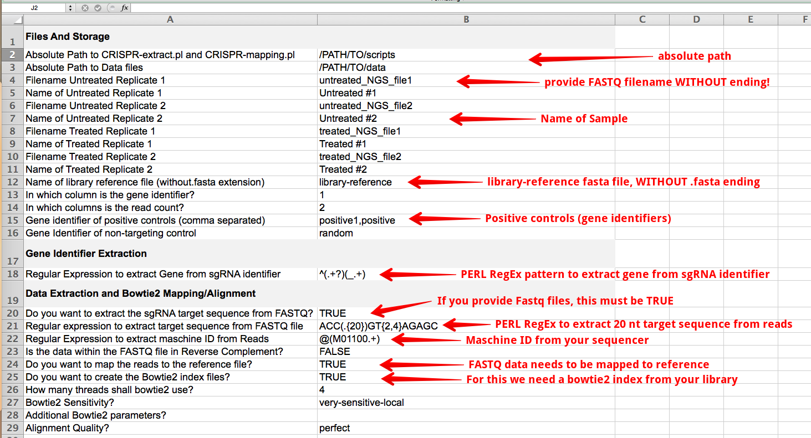


### Using Read Count Files

Instead of using raw NGS Fastq files, caRpools can also be used to directly analysis read-count files without fastq data extraction and mapping.  
In this case, already finalized read-count files are provided that must be in the same format as described in **Read Count Data Files**.  

If you provide read-count files, please make sure you fill out the MIACCS file accordingly.  
An example of a MIACCS file for read-count files is shown below.

#### Example of a MIACCS File entry for Read-Count files

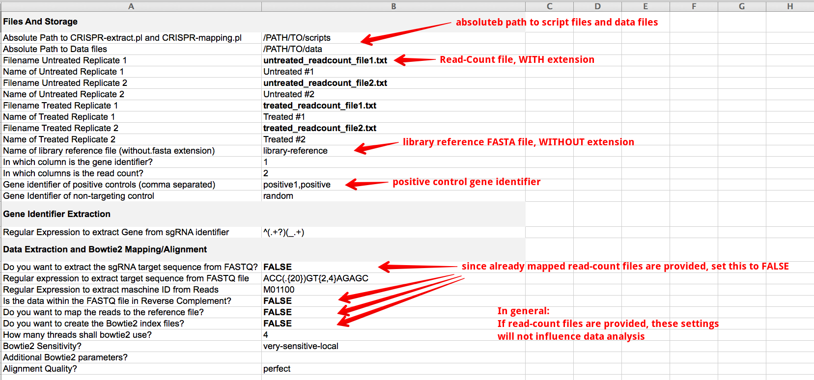

### Data Analysis Options

CaRpools is not only meant as a tool for standardized and fully reproducible data analysis of CRISPR-Cas screens, but also fosters exploratory data analysis.  
Therefore caRpools offers the user different options for data analysis as illustrated below. All options can be set within the MIACCS file or directly passed on to the individual functions of caRpools (advanced users).  

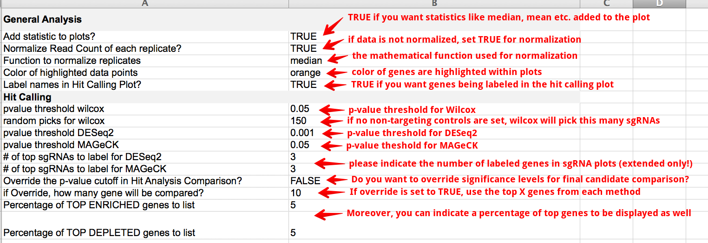


## Providing more than two replicates per Group

CaRpools allows the usage of more than two replicates for both the untreated and treated groups. However, the standard templates we provide accept two biological replicates only.  

There are two ways of using the caRpools report generation function with more replicates:

* use the provided templates stating __4-replicates__
* modify the templates

If you like to modify the template of caRpools, you just need to add certain statements for the additional replicates. This will change with the next larger update.  

#### Load more files

When loading files (e.g. read-count files or fastq files for extraction), you can just put additional code of the following scheme:

```{r, eval=FALSE, echo=TRUE}
## for data extraction of a third replicate or more

# First edit the MIACCS file loading
fileCONTROL3 = as.character(miaccs["carpools.untreated3",3])
d.CONTROL3 = as.character(miaccs["carpools.untreated3.desc",3])

fileTREAT3 = as.character(miaccs["carpools.treated3",3])
d.TREAT3 = as.character(miaccs["carpools.treated3.desc",3])

# Additional CONTROL replicate
fileCONTROL3 = data.extract(scriptpath, datapath, fastqfile=fileCONTROL3,
extract, seq.pattern, maschine.pattern, createindex, referencefile,
mapping, reversecomplement, threads, bowtieparams, sensitivity, match)
# Additional Treatment replicate
fileTREAT3 = data.extract(scriptpath, datapath, fastqfile=fileTREAT3,
extract, seq.pattern, maschine.pattern, createindex, referencefile,
mapping, reversecomplement, threads, bowtieparams, sensitivity, match)

## If you do not want to extract FASTQ files, but just load a read-count file this is the way to go

CONTROL3 = load.file(paste(datapath, fileCONTROL3, sep="/"))
TREAT3 = load.file(paste(datapath, fileTREAT3, sep="/"))

```

#### QC plots and Gene Annotation using several replicates

In principal you can use as many replicates per treatment group as you want, the minimum however is two replicates.
Some of the QC plots and other functions require single replicates, others can be used with as many replicates as you want directly within the function call.

This means you need to call the function for each replicate separately for the following functions:   

* load.file
* data.extract
* get.gene.info
* aggregatetogenes
* stats.data
* unmapped.genes
* carpools.read.distribution
* carpools.reads.genedesigns

These function accept several replicates directly as a list:

* carpools.read.depth
* carpools.readcount.vs
* stat.wilcox
* stat.deseq
* stat.mageck

All other functions do not depend on read-count data directly so that you do not think about replicates for those, as all handling is done automatically.

#### Provide more replicates to statistical analysis

```{r, eval=FALSE, echo=TRUE}

## WILCOX
# Provide more replicates as list
data.wilcox = stat.wilcox(untreated.list = list(CONTROL1, CONTROL2, CONTROL3, CONTROL4),
treated.list = list(TREAT1,TREAT2, TREAT3, TREAT4), namecolumn=namecolumn,
fullmatchcolumn=fullmatchcolumn, normalize=normalize, norm.fun=norm.function,
sorting=FALSE, controls=controls.nontarget, control.picks=control.picks)

## DESEQ2
data.deseq = stat.DESeq(untreated.list =  list(CONTROL1, CONTROL2, CONTROL3, CONTROL4),
treated.list = list(TREAT1,TREAT2, TREAT3, TREAT4), namecolumn=namecolumn,
fullmatchcolumn=fullmatchcolumn, extractpattern=g.extractpattern, sorting=FALSE,
filename.deseq = paste(analysis.name, "-ANALYSIS-DESeq2-sgRNA.tab", sep=""), sgRNA.pval = sig.pval.deseq, fitType="mean")

## MAGECK
data.mageck = stat.mageck(untreated.list = list(CONTROL1, CONTROL2, CONTROL3, CONTROL4),
treated.list = list(TREAT1,TREAT2, TREAT3, TREAT4), namecolumn=namecolumn,
fullmatchcolumn=fullmatchcolumn, norm.fun="median", extractpattern=g.extractpattern,
mageckfolder=NULL, sort.criteria="neg", adjust.method="fdr",
filename = paste(analysis.name, "-ANALYSIS-MAGeCK-RAW", sep=""), fdr.pval=sig.pval.mageck)

```


# Start CaRpools Report Generation

You can start caRpools Report Generation after you did the following steps:

* Installed all required software and R packages (use _check.caRpools(files=FALSE)_ to verify)
* Put every file in the correct folder (MIACCS, data files, script files, Rmd templates)
* Put everything in the R working directory or set the working directory to the folder of your files
* Filled out the MIACCS file with all information, e.g. correct filenames, reference, data analysis options

You can check for all requirements by calling `check.caRpools`.

## Start CaRpools using R-Studio

In the case you use R-Studio, you can start caRpools by just opening the corresponding Rmd template file.  
At the top, you will find the **Knit PDF** or **Knit HTML** button, so you just need to press that and caRpools will generate the report.  

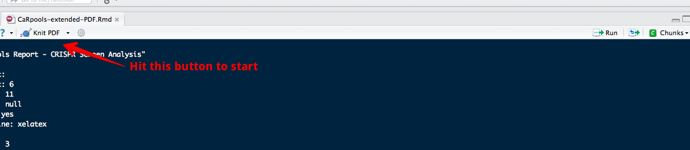

As an alternative, you can start caRpools via `use.caRpools` and provide additional parameters (see below).  

## Start CaRpools using R console

Moreover, caRpools report generation can also be initiated without R-studio installation, so that this can be done via R command line even on remote computers.  
In this case, caRpools report generation can be started via `use.caRpools` with additional parameters, which are described below.  

#### use.caRpools()

**Usage:**  
`use.caRpools(type=NULL, file="CaRpools-extended-PDF.Rmd", miaccs="MIACCS.xls", check=TRUE, work.dir=NULL)`  

**type**  
*Description* If you provide a custom Rmd template that can generate both, PDF and HTML reports you can indicate which version you want to generate.  
*Default* NULL  
*Values* "PDF", "HTML"  

**file**  
*Description* The file name of your custom Rmd template file (with extension).  
*Default* "CaRpools-extended-PDF.Rmd"  
*Values* filename as character  

**miaccs**  
*Description* The filename of your MIACCS file.  
*Default* "MIACCS.xls"  
*Values* filename as character 

**check**  
*Description* Indicates whether caRpools will check for correct installation and file access.  
*Default* TRUE  
*Values* TRUE or FALSE (boolean)  

**work.dir**  
*Description* You can provide the absolute path to the working directory in which all files are placed (e.g. the MIACCS.xls and Rmd template).  
*Default* NULL 
*Values* absolute path (character) or NULL if standard R working directory is used

\newpage

# Using CaRpools as a stand-alone R Package

**CaRpools can be used without the provided R markdown templates to generate own reports or individualized analysis of CRISPR/Cas9 screens.**  
The following sections will explain every function included in CaRpools and provide hints, tips and a documentation of how to use CaRpools for data analysis. This will help you in customizing the generated reports to you needs, create new reports or just use single functions of CaRpools within your data analysis workflow.

## Loading Data

CaRpools offers two ways of providing CRISPR/Cas9 screening data.  
Either raw **read-count files** are directly used as described before, or read-count files are generated from NGS FASTQ files by extracting the 20 nt target sequence, mapping it against a reference library and extracting the read-count information for each sgRNA identifier.


```{r load-file, echo=TRUE, eval=FALSE}
CONTROL1 = load.file("./data/untreated1.txt", header= TRUE, sep="\t")
```

**Usage**  
`load.file(filename, header = TRUE, sep="\t", comment.char="", type = NULL)`  

**filename** 
Filename to be loaded. If read-count files are loaded, please include the extension.
For FASTQ files, please pass on the output of `data.extract` as this is the filename of the extracted file.  
*Default* empty  
*Values* filename (character) or output from `data.extract`  

**header**  
Is the first line just a header?  
*Default* TRUE  
*Values* TRUE, FALSE (boolean)  

**sep**  
Separator of data, usually tab-separated.  
*Default* "\t" for TAB-separated data  
*Values* Any separator  

**comment.char**  
Are character files within any quote etc?
*Default* ""
*Values* Any character  

**type**  
Indicates which files are being loaded. Three file-types are possible. Either NULL for tab-separated files, fastalib for library reference files or xlsx for loading the MIACCS file.  
*Default* NULL
*Values* NULL, "fastalib", "xlsx"  

### Loading Read-Count files Directly

Read-Count files (normalized or not normalized) can be loaded with `load.file` into a data frame that is used for further usage.  
For each untreated and treated sample two replicates are used:  

```{r load-files-read-count, echo=TRUE, eval=FALSE}
CONTROL1 = load.file("./data/untreated1.txt", header= TRUE, sep="\t")
CONTROL = load.file("./data/untreated2.txt", header= TRUE, sep="\t")
TREAT1 = load.file("./data/treated1.txt", header= TRUE, sep="\t")
TREAT2 = load.file("./data/treated2.txt", header= TRUE, sep="\t")

# Don't forget the library reference
libFILE = load.file(
  paste(datapath, paste(referencefile,".fasta",sep=""), sep="/"),header = FALSE,
  type="fastalib")
```

### Loading FASTQ Files to Generate Read-Count Files

In a first step, NGS FASTQ data is extracted and mapped against a reference library file using bowtie2.

```{r load-files-fastq, echo=TRUE, eval=FALSE}
fileCONTROL1 = data.extract(
  scriptpath="path.to.scripts", datapath="path.to.FASTQ",fastqfile="filename1",
  extract=TRUE, seq.pattern, maschine.pattern, createindex=TRUE,
  bowtie2file=filename.lib.reference, referencefile="filename.lib.reference",
  mapping=TRUE, reversecomplement=FALSE, threads, bowtieparams,
  sensitivity="very-sensitive-local",match="perfect")  
# Now we can load the generated Read-Count file directly!
CONTROL1 = load.file(paste(datapath, fileCONTROL1, sep="/")) # Untreated sample 1 loaded

# Don't forget the library reference
libFILE = load.file(
  paste(datapath, paste(referencefile,".fasta",sep=""), sep="/"),header = FALSE,
  type="fastalib")
```

A closer look to the data frame we just loaded:  

`r knitr::kable(CONTROL1[40:50,])`  

#### data.extract()

**Usage:**  
`data.extract(scriptpath=NULL, datapath=NULL, fastqfile=NULL, extract = FALSE, pattern = "default", maschinepattern = "default", createindex = FALSE, bowtie2file = NULL, referencefile= NULL, mapping = FALSE, reversecomplement = FALSE, threads = 1, bowtieparams = "", sensitivity = "very-sensitive-local", match = "perfect")`  

**scriptpath**  
Absolute path of the folder that contains `CRISPR-extract.pl` and `CRISPR-mapping.pl`  
*Default* NULL  
*Values* absolute path (character)  

**datapath**  
Absolute path of the folder that contains the data files (e.g. file.FASTQ)  
*Default* NULL  
*Values* absolute path (character)  

**fastqfile**  
Filename of FASTQ file WITHOUT .fastq extension  
*Default* NULL  
*Values* filename (character)  

**extract**  
Whether CRISPR-extract.pl is used to extract the 20 nt target sequence from the NGS reads using `pattern` 
*Default* FALSE  
*Values* TRUE, FALSE (boolean)  

**pattern**  
PERL regular Expression to extract 20 nt target sequence from NGS reads. Please see *extract pattern* in this manual for more information.  
*Default* Regular Expression (character)  

**maschinepattern**  
Machine ID of your Sequencing machine. Used to identify the read id.  

**createindex**  
Do you want caRpools to generate a bowtie2 index? Only necessary if `mapping=TRUE`.
*Default* FALSE  
*Values* TRUE, FALSE  

**bowtie2file**  
Filename of bowtie2 index file, without extension. Is the same as reference file, if `createindex=TRUE`.  

**referencefile**  
Filename of the library reference FASTA file, without extension. Is the same as bowtie2 file, if `createindex=TRUE`.  

**mapping**  
Indicates whether FASTQ files need to be mapped against `referencefile`/`bowtie2file`. FALSE by default.  
*Default* FALSE  
*Values* TRUE, FALSE  

**reversecomplement**  
Is the NGS sequence in reverse complement order?  
*Default* FALSE  
*Values* TRUE, FALSE  

**threads**  
How many threads can bowtie2 use for mapping? Only used if `mapping=TRUE`. Usually cores of CPU.  
*Default* 2  
*Values* any integer  

**bowtieparams**  
If you want to pass additional parameters to bowtie2.  

**sensitivity**  
You can adjust the sensitivity of bowtie2 using this parameter. By default, bowtie2 is used in a very-sensitive-local setting. More information about different sensitivity parameters can be found at the [bowtie2 options](http://bowtie-bio.sourceforge.net/bowtie2/manual.shtml#options).  
*Default* "very-sensitive-local"  
*Other options: very-fast, fast, sensitive, very-fast-local, fast-local, sensitive-local*  

**match**  
After bowtie2 mapping, the alignment is converted into read count files *filename_extracted-design.txt* and *filename_extracted-genes.txt*.  
You can indicate how well the alignment must be in order to be used for generating the read count for each sgRNA.  
By default, this is set to *perfect*, which only employs a mapped read if the full 20 nt from the sequencing match perfectly to the sgRNA found in your library reference. The following options can be used:  

* __perfect__ - Read is used of all 20 nt from the sequencing are matching the target sequence given in the library reference
* __high__ - Read is used if at least 18 nt (starting from the PAM) are matching the target sequence in the reference
* __seed__ - Read is used if at least 14 nt (starting from the PAM) are a perfect match against the target sequence in the reference  

### Aggregating sgRNA read-count to Gene read-count

CaRpools allows you to aggregate sgRNA read-counts to gene read-counts using `aggregatetogenes()`.  

```{r aggregate1, echo=TRUE, eval=FALSE}
CONTROL1.g=aggregatetogenes(data.frame = CONTROL1, agg.function=sum,
        extractpattern = expression("^(.+?)(_.+)"),type = "aggregate")
```

#### aggregatetogenes()

**Usage**  
`aggregatetogenes(data.frame, namecolumn=1, countcolumn=2, agg.function=sum, extractpattern=expression("^(.+?)_.+"), type="aggregate")`  

**data.frame**  
A data-frame of sgRNA read-count data as done by `load.file`  
*Default* empty  
*Values* data-frame  

**namecolumn**  
In which column are the sgRNA identifiers?  
*Default* 1  
*Values* column number (numeric)  

**countcolumn**  
In which column are the read counts?  
*Default* 2  
*Values* column number (numeric)  

**extractpattern**  
PERL regular expression that is used to retrieve the gene identifier from the overall sgRNA identifier.  
e.g. in **AAK1_107_0** it will extract **AAK1**, since this is the gene identifier belonging to this sgRNA identifier. **Please see: Read-Count Data Files**  
*Default* expression("^(.+?)(_.+)"), will work for most available libraries.  
*Values* PERL regular expression with parenthesis indicating the gene identifier (expression)  

**type**  
CaRpools can either aggregate the data frame (`type = "annotate"`) or annotate the gene identifiers only as an additional column (`type = "annotate"`).  
*Default* "aggregate"  
*Values* "aggregate", "annotate"  

##### Example for data aggregation

```{r aggregate-example1, echo=TRUE, eval=FALSE}
CONTROL1.g=aggregatetogenes(data.frame = CONTROL1, agg.function=sum,
            extractpattern = expression("^(.+?)(_.+)"), type="aggregate")
knitr::kable(CONTROL1.g[1:10,])
```

`r knitr::kable(CONTROL1.g[1:10,])`

##### Example for data annotation

```{r aggregate-example2, echo=TRUE, eval=TRUE}
CONTROL1.g.annotate=aggregatetogenes(data.frame = CONTROL1, agg.function=sum,
            extractpattern = expression("^(.+?)(_.+)"), type="annotate")
knitr::kable(CONTROL1.g.annotate[1:10,])
```


### Convert Gene Identifier or Annotate Gene Information

It is also possible to either enrich the screening data-set file with additional information provided by the biomaRt interface.  
For example, gene identifiers can be changed from EnsemblIDs to official gene symbols are Gene Ontology terms can be added to the data-set.  
This can be done using `get.gene.info`, which serves as a wrapper for the **biomaRt** package with its load of options and possibilities (more information see `?biomaRt`).  

You can convert any gene identifier which is included in your sgRNA identifier to e.g. EnsemblID or HGNC Gene Symbol using caRpools.  
**Please note that Internet Access is required for biomaRt.**  
For further information about biomaRt conversion, please see the [biomaRt Manual](www.bioconductor.org/packages/release/bioc/vignettes/biomaRt/inst/doc/biomaRt.pdf).  

```{r get.gene.info, echo=TRUE,eval=FALSE}
# Convert HGNC gene symbol to EnsemblID
CONTROL1 = get.gene.info(
  CONTROL1, namecolumn=1, extractpattern=expression("^(.+?)(_.+)"),
  database="ensembl", dataset="hsapiens_gene_ensembl", filters="hgnc_symbol",
  attributes = "ensembl_gene_id", return.val = "dataset")
# Also convert the library reference
libFILE = get.gene.info(
  libFILE, namecolumn=1, extractpattern=expression("^(.+?)(_.+)"),
  database="ensembl", dataset="hsapiens_gene_ensembl", filters="hgnc_symbol",
  attributes = "ensembl_gene_id", return.val = "dataset")
```

This will convert a gene identifier, which is extracted by a PERL Regular Expression **(.+?)(_.+)** and of type hgnc_symbol (gene symbol), to an Ensembl Gene ID.  

#### get.gene.info()

**Usage**  
`get.gene.info = function(data, namecolumn=1, extractpattern=expression("^(.+?)(_.+)"), database="ensembl", dataset="hsapiens_gene_ensembl", filters="ensembl_gene_id", attributes = c("hgnc_symbol"), return.val = "dataset", controls=FALSE)`  

**data**
Data frame that contains read-count data.
*Default* none
*Values* data.frame containing read-count data (data.frame)  

**namecolumn**  
In which column are the sgRNA identifiers?  
*Default* 1  
*Values* column number (numeric)  

**extractpattern**  
PERL regular expression that is used to retrieve the gene identifier from the overall sgRNA identifier.  
e.g. in **AAK1_107_0** it will extract **AAK1**, since this is the gene identifier belonging to this sgRNA identifier. **Please see: Read-Count Data Files**  
*Default* expression("^(.+?)(_.+)"), will work for most available libraries.  
*Values* PERL regular expression with parenthesis indicating the gene identifier (expression)  

**database**  
BiomaRt database to be used. See `?listMarts()` or biomaRt documentation.  
*Default* "ensembl", is using the ensembl database  
*Values* Any biomaRt database (character)  

**dataset**  
The biomaRt data-set to be used. For *homo sapiens*, *hsapiens_gene_ensembl* is recommended. See `?listDatasets` or biomaRt documentation.  
*Default* "hsapiens_gene_ensembl"  
*Values* Any biomaRt data-set (character)  

**filters**  
The input filter information to retrieve biomaRt annotation, usually is the type of gene identifier used in the read-count files, e.g. "ensemble_gene_id". see `?listFilters`  
*Default* "ensembl_gene_id"  
*Values* Any biomaRt filter (character)  

**attributes**  
The output attribute to retrieve from biomaRt, usually the annotations that need to be fetched, e.g. "hgnc_symbol". see `?listAttributes`  
*Default* "hgnc_symbol"  
*Values* Any biomaRt attribute (character)  

**return.val**  
The type of object that is returned. For whole data-set, e.g. conversion of gene identifiers, use "dataset".  
*Default* "dataset"  
*Values* "dataset" (will give back the same data frame, but with exchanged gene identifiers), "info" (will return a data frame with all attributes fetched for genes, is used to annotate gene with additional information)  

**controls**  
Is set to TRUE if `data` is not a data frame, but a vector.  
*Default* FALSE  
*Values* TRUE, FALSE (boolean)  

##### Example: Replace Gene Identifier (EnsemblID) by Official Gene Symbol

```{r geneinfo-replace, echo=TRUE, eval=TRUE}
CONTROL1.replaced = get.gene.info(CONTROL1, namecolumn=1,
      extractpattern=expression("^(.+?)(_.+)"), database="ensembl", dataset="hsapiens_gene_ensembl",
      filters="hgnc_symbol", attributes = c("ensembl_gene_id"), return.val = "dataset")

knitr::kable(CONTROL1.replaced[1:10,])
```

##### Example: Enrich Dataset by Gene Description

```{r geneinfo-replace2, echo=TRUE, eval=TRUE}
CONTROL1.replaced.info = get.gene.info(CONTROL1, namecolumn=1,
      extractpattern=expression("^(.+?)(_.+)"), database="ensembl", dataset="hsapiens_gene_ensembl",
      filters="hgnc_symbol", attributes = c("ensembl_gene_id","description"), return.val = "info")

knitr::kable(CONTROL1.replaced.info[1:10,])
```

\newpage

## Quality Control of pooled CRISPR Screening data

There are several different functions available to determine the quality of your data:  

  * General Data-set Statistics
  * Specific Statistics of Included Controls
  * Read-count Distribution `plot.read.distribution`
  * Read Depth `plot.read.depth`
  * sgRNAs present per Gene Target `plot.reads.genedesigns`
  * Read-count comparison of different samples `plot.read.count.vs`
  * Information about the phenotype of sgRNAs `plot.raw.genes`
 
### Dataset Statistics

```{r stats-general-pre, echo=FALSE, eval=TRUE}
# General
U1.stats = stats.data(dataset=CONTROL1, namecolumn = 1, fullmatchcolumn = 2,
                      extractpattern=expression("^(.+?)_.+"), type="stats")
U2.stats = stats.data(dataset=CONTROL2, namecolumn = 1, fullmatchcolumn = 2,
                      extractpattern=expression("^(.+?)_.+"), type="stats")
T1.stats =stats.data(dataset=TREAT1, namecolumn = 1, fullmatchcolumn = 2,
                     extractpattern=expression("^(.+?)_.+"), type="stats")
T2.stats =stats.data(dataset=TREAT2, namecolumn = 1, fullmatchcolumn = 2,
                     extractpattern=expression("^(.+?)_.+"), type="stats")
# Combine Stats
combined.stats = cbind.data.frame(U1.stats[,1:2], U2.stats[,2], T1.stats[,2], T2.stats[,2])
colnames(combined.stats) = c("Readcount", d.CONTROL1, d.CONTROL2, d.TREAT1, d.TREAT2)
```

General statistics for a given data-set can be obtained by `stats.data`.  
For further information about the possibilities, see `?stats.data`.  

A typical table would look like this (shorted):  

`r knitr::kable(combined.stats)`

```{r stats-general, echo=TRUE, eval=FALSE}
# General
U1.stats = stats.data(dataset=CONTROL1, namecolumn = 1, fullmatchcolumn = 2,
                      extractpattern=expression("^(.+?)_.+"), type="stats")
U2.stats = stats.data(dataset=CONTROL2, namecolumn = 1, fullmatchcolumn = 2,
                      extractpattern=expression("^(.+?)_.+"), type="stats")
T1.stats =stats.data(dataset=TREAT1, namecolumn = 1, fullmatchcolumn = 2,
                     extractpattern=expression("^(.+?)_.+"), type="stats")
T2.stats =stats.data(dataset=TREAT2, namecolumn = 1, fullmatchcolumn = 2,
                     extractpattern=expression("^(.+?)_.+"), type="stats")
# Combine Stats
combined.stats = cbind.data.frame(U1.stats[,1:2], U2.stats[,2], T1.stats[,2], T2.stats[,2])
colnames(combined.stats) = c("Readcount", d.CONTROL1, d.CONTROL2, d.TREAT1, d.TREAT2)

# output all to a file
xlsx::write.xlsx(combined.stats, file="General-stats.xls", sheetName="Combined Stats", row.names=FALSE)

# Create stats for whole data set
U1.allstats = stats.data(dataset=CONTROL1, namecolumn = namecolumn,
    fullmatchcolumn = fullmatchcolumn, extractpattern=g.extractpattern, type="dataset")
```

#### stats.data()

**Usage**  
`stats.data = (dataset, namecolumn = 1, fullmatchcolumn = 2, extractpattern=expression("^(.+?)_.+"), readcount.unmapped.total = NA, controls.target = NULL, controls.nontarget = "random", type="stats")`  

**dataset**  
Data frame of read-count object.  
*Default* none  
*Values* data frame as created by `load.file()`  

**namecolumn**  
In which column are the sgRNA identifiers?  
*Default* 1  
*Values* column number (numeric)  

**fullmatchcolumn**  
In which column are the read counts?  
*Default* 2  
*Values* column number (numeric)  

**extractpattern**  
PERL regular expression that is used to retrieve the gene identifier from the overall sgRNA identifier.  
e.g. in **AAK1_107_0** it will extract **AAK1**, since this is the gene identifier belonging to this sgRNA identifier. **Please see: Read-Count Data Files**  
*Default* expression("^(.+?)(_.+)"), will work for most available libraries.  
*Values* PERL regular expression with parenthesis indicating the gene identifier (expression)  

**readcount.unmapped.total**  
Number of raw NGS reads, only used if `type="mapping`.  
*Default* NA  
*Values* Number of raw reads (integer)  

**controls.target**  
If `type="controls"`, this is the gene identifier of the positive control.  
*Default* NULL  
*Value* Gene Identifier (character)  

**controls.nontarget**  
If `type="controls"`, this is the gene identifier of the non-targeting control.  
*Default* "random"  
*Value* Gene Identifier (character)  

**type**  
Which type of statistic will be generated.  
*Default* "stats"  
*Values* "stats" will generate short statistics like median and mean for the data set, 
"mapping" will generate an overview of how many reads are present,
"dataset" is used to generate in-depth statistics for each gene of a data-set,
"controls" is used for in-depth statistics of the controls.  

##### Example of Mapping Statistic

If `readcount.unmapped.total` is provided, which is the number of raw read counts for a given data-set before mapping back to a reference, the percentage of mapped data can be obtained.

```{r unmapped-readcount, echo=TRUE, eval=TRUE}
knitr::kable(stats.data(dataset=CONTROL1, namecolumn = 1, fullmatchcolumn = 2,
  extractpattern=expression("^(.+?)_.+"), readcount.unmapped.total = 1786217, type="mapping"))
```

##### Example of Dataset Statistics

In addition to mapping information, whole data-set statistics can be plotted.

```{r dataset-readcount, echo=TRUE, eval=TRUE}
knitr::kable(stats.data(dataset=CONTROL1, namecolumn = 1, fullmatchcolumn = 2,
  extractpattern=expression("^(.+?)_.+"), readcount.unmapped.total = 1786217,
  type="stats"))
```

Furthermore, detailed lists can be created for each data-set.

```{r list-readcount, echo=TRUE, eval=TRUE}
knitr::kable(stats.data(dataset=CONTROL1, namecolumn = 1, fullmatchcolumn = 2,
  extractpattern=expression("^(.+?)_.+"), readcount.unmapped.total = 1786217,
  type="dataset")[1:10,1:5])
```

### Missing sgRNAs

CaRpools also provides you with the number of missing sgRNA, that means sgRNAs without a single read during NGS.

```{r stats-dropouts, echo=TRUE}
# Calculate the number
U1.unmapped = unmapped.genes(data=CONTROL1, namecolumn=1, fullmatchcolumn=2, genes=NULL, extractpattern=expression("^(.+?)_.+"))

# output to a file
xlsx::write.xlsx(U1.unmapped, file="DROPOUT.xls", sheetName=d.CONTROL1, row.names=FALSE)
```

The output is sorted by Gene identifiers:  
`r knitr::kable(U1.unmapped[1:10,])`  

If you want to know WHICH sgRNAs dropped out for a given gene, please consider using `genes` as an optional argument with the gene identifier of interest:  

```{r stats-dropouts1, echo=TRUE}
# Calculate the number
U1.unmapped = unmapped.genes(data=CONTROL1, namecolumn=1, fullmatchcolumn=2, genes="random", extractpattern=expression("^(.+?)_.+"))
```

`r knitr::kable(U1.unmapped[1:10,])`

#### unmapped.genes()

**Usage**  
`unmapped.genes(data, namecolumn=1, fullmatchcolumn=2, genes=NULL, extractpattern=expression("^(.+?)_.+"))`  

**data**  
A data.frame as created by `load.file`.  
*Default* empty  
*Values* read-count data.frame  

**namecolumn**  
In which column are the sgRNA identifiers?  
*Default* 1  
*Values* column number (numeric)  

**fullmatchcolumn**  
In which column are the read counts?  
*Default* 2  
*Values* column number (numeric)  

**genes**  
If you want to know how many sgRNAs are not present for a single gene, set `genes` to your gene identifier of interest.  
*Default* NULL  
*Values* gene identifier (character)  

**extractpattern**  
PERL regular expression that is used to retrieve the gene identifier from the overall sgRNA identifier.  
e.g. in **AAK1_107_0** it will extract **AAK1**, since this is the gene identifier belonging to this sgRNA identifier. **Please see: Read-Count Data Files**  
*Default* expression("^(.+?)(_.+)"), will work for most available libraries.  
*Values* PERL regular expression with parenthesis indicating the gene identifier (expression)  


### Read-Count Distribution

A distribution for NGS data read-count can be created by `carpools.read.distribution` to visualize how the data set is distributed.  
This allows to check for data skewness and to estimate the overall assay quality.  
For further details see `?carpools.read.distribution`.  

```{r carpools.read.distribution, echo=TRUE, eval=FALSE, sanitize=TRUE}
carpools.read.distribution(CONTROL1, fullmatchcolumn=2, breaks=200,
  title=d.CONTROL1, xlab="log2 Readcount", ylab="# sgRNAs",statistics=TRUE) 
carpools.read.distribution(CONTROL1, fullmatchcolumn=2, breaks=200,
  title=d.CONTROL1, xlab="log2 Readcount", ylab="# sgRNAs",statistics=TRUE, type="whisker") 
```

#### carpools.read.distribution()

**Usage**  
`carpools.read.distribution=(dataset,namecolumn=1, fullmatchcolumn=2,breaks="NULL", title="Title", xlab="X-Axis", ylab="Y-Axis",statistics=TRUE, col=rgb(0, 0, 0, alpha = 0.65), extractpattern=expression("^(.+?)_.+"), plotgene=NULL, type="distribution", logscale=TRUE)`   

**dataset**
Data frame of read-count data as created by load.file().  
*Default* none  
*Values* A data frame  

**namecolumn**  
In which column are the sgRNA identifiers?  
*Default* 1  
*Values* column number (numeric)  

**fullmatchcolumn**  
In which column are the read counts?  
*Default* 2  
*Values* column number (numeric)  

**breaks**  
Histogram breaks see `?hist`. By default, will be calculated according to the data-set length.  
*Default* NULL
*Values* (numeric)  

**title**  
Main title of plot  
*Default* "Title"  
*Values* "The title you want" (character)  

**xlab**  
Label of X-Axis  
*Default* "X-Axis"  
*Values* "Label of X-Axis" (character)  

**ylab**  
Label of Y-Axis  
*Default* "Y-Axis"  
*Values* "Label of Y-Axis" (character)  

**statistics**  
Whether basic statistics will be shown in the plot.  
*Default* TRUE  
*Values* TRUE, FALSE (boolean)  

**col**  
The color of the plotted data. Can be any R color or RGB object. See ?rgb() for further information.  
*Default* rgb(0, 0, 0, alpha = 0.65)  
*Values* Any R color name or RGB color object (character OR color object)  

**extractpattern**  
PERL regular expression that is used to retrieve the gene identifier from the overall sgRNA identifier.  
e.g. in **AAK1_107_0** it will extract **AAK1**, since this is the gene identifier belonging to this sgRNA identifier. **Please see: Read-Count Data Files**  
*Default* expression("^(.+?)(_.+)"), will work for most available libraries.  
*Values* PERL regular expression with parenthesis indicating the gene identifier (expression)  

**plotgene**  
You can only plot the read count distribution of sgRNAs belonging to a certain gene, which is given to the function via plotgene.  
*Default* NULL  
*Value* NULL or gene identifier (character)  

**type**  
You can plot either the read count distribution either as a normal histogram, or a box-and-whisker plot.  
*Default* "distribution"  
*Values* "distribution" to plot a histogram, or "whisker" to plot a whisker plot (character)  

**logscale**  
Indicates whether the read-count is plotted in a logarithmic scale.  
*Default* TRUE  
*Values* TRUE, FALSE (boolean)  

##### Example for Read-Count Distribution

```{r read-distribution, echo=TRUE,fig.height=4, eval=TRUE}
# Histogram
carpools.read.distribution(CONTROL1, fullmatchcolumn=2,breaks=200,
  title=d.CONTROL1, xlab="log2 Readcount", ylab="# sgRNAs",statistics=TRUE) 
```

```{r read-distribution-whisker, echo=TRUE,fig.height=4, eval=TRUE}
# Whisker
carpools.read.distribution(CONTROL1, fullmatchcolumn=2,breaks=200,
  title=d.CONTROL1, xlab="log2 Readcount", ylab="# sgRNAs",statistics=TRUE,
  type="whisker") 
```

```{r read-distribution-onlygene, echo=TRUE,fig.height=4, eval=TRUE}
# Histogram
carpools.read.distribution(CONTROL1, fullmatchcolumn=2,breaks=200,
  title=d.CONTROL1, xlab="log2 Readcount", ylab="# sgRNAs",statistics=TRUE, plotgene="CASP8") 
```


### Sequencing Read Depth per sgRNA

You can also visualize the read depth of genes per sgRNA in order to check for sufficient sequencing depth using `carpools.read.depth`.  
For further details see `?carpools.read.depth`.  
You can either plot single data samples or all four data samples at once.  

```{r QC-readdepth, echo=TRUE, eval=FALSE, sanitize=TRUE}
# Plot for a singe sample
carpools.read.depth(datasets = list(CONTROL1), namecolumn=1 ,fullmatchcolumn=2,
  dataset.names=list(d.CONTROL1), extractpattern=expression("^(.+?)_.+"),
  xlab="Genes", ylab="Read Count per sgRNA",statistics=TRUE, labelgenes = NULL,
  controls.target = NULL, controls.nontarget="random")

# Plot for 4 samples at once
carpools.read.depth(datasets = list(CONTROL1,CONTROL2,TREAT1,TREAT2), namecolumn=1,
  fullmatchcolumn=2, dataset.names=list(d.CONTROL1,d.CONTROL2,d.TREAT1,d.TREAT2),
  extractpattern=expression("^(.+?)_.+"), xlab="Genes", ylab="Read Count per sgRNA", 
  statistics=TRUE, labelgenes = NULL, controls.target = NULL, controls.nontarget="random")
```     

#### carpools.read.depth()

**Usage**  
`carpools.read.depth(datasets, namecolumn=1, fullmatchcolumn=2, dataset.names=NULL, extractpattern=expression("^(.+?)_.+"), col=rgb(0, 0, 0, alpha = 0.65), xlab="Genes", ylab="Read Count per sgRNA", statistics=TRUE, labelgenes = NULL, controls.target = controls.target, controls.nontarget=controls.nontarget, labelcolor="orange", waterfall=FALSE)`

**dataset**
A list of data frames of read-count data as created by load.file().  
*Default* none  
*Values* A list of data frames  

**namecolumn**  
In which column are the sgRNA identifiers?  
*Default* 1  
*Values* column number (numeric)  

**fullmatchcolumn**  
In which column are the read counts?  
*Default* 2  
*Values* column number (numeric)  

**dataset.names**  
A list of names that must be according to the list of data sets given in *dataset*.  
*Default* NULL  
*Value* NULL or list of data names (list)  

**extractpattern**  
PERL regular expression that is used to retrieve the gene identifier from the overall sgRNA identifier.  
e.g. in **AAK1_107_0** it will extract **AAK1**, since this is the gene identifier belonging to this sgRNA identifier. **Please see: Read-Count Data Files**  
*Default* expression("^(.+?)(_.+)"), will work for most available libraries.  
*Values* PERL regular expression with parenthesis indicating the gene identifier (expression)  

**col**  
The color of the plotted data. Can be any R color or RGB object. See ?rgb() for further information.  
*Default* rgb(0, 0, 0, alpha = 0.65)  
*Values* Any R color name or RGB color object (character OR color object)  

**xlab**  
Label of X-Axis  
*Default* "X-Axis"  
*Values* "Label of X-Axis" (character)  

**ylab**  
Label of Y-Axis  
*Default* "Y-Axis"  
*Values* "Label of Y-Axis" (character)  

**statistics**  
Whether basic statistics will be shown in the plot.  
*Default* TRUE  
*Values* TRUE, FALSE (boolean)  

**labelgenes**  
You can highlight certain genes within the plot. This expects a gene identifier or a vector of gene identifiers.  
*Default* NULL  
*Values* A gene identifier or vector of gene identifiers (character)  

**labelcolor**  
Color to highlight genes stated in `labelgenes`.  
*Default* "orange"  
*Values* Any R color or RGB color object.  

**controls.target**  
Highlights the positive control in red color.  
*Default* NULL  
*Value* Gene Identifier (character)  

**controls.nontarget**  
Highlights the non-targeting control in blue color.  
*Default* "random"  
*Value* Gene Identifier (character)  

**waterfall**  
You can either plot the read depth sorted by gene identifier (FALSE, default) or according to the read depth.  
*Default* FALSE  
*Values* TRUE, FALSE (boolean)  


##### Example for Read Depth

```{r read-depth-example1, echo=TRUE, eval=TRUE}
# Plot for a singe sample
carpools.read.depth(datasets = list(CONTROL1), namecolumn=1 ,fullmatchcolumn=2,
  dataset.names=list(d.CONTROL1), extractpattern=expression("^(.+?)_.+"),
  xlab="Genes", ylab="Read Count per sgRNA",statistics=TRUE, labelgenes = NULL,
  controls.target = "CASP8", controls.nontarget="random", waterfall=FALSE)
```

```{r read-depth-example2, echo=TRUE, eval=TRUE}
# Plot for a singe sample sorted to read depth
carpools.read.depth(datasets = list(CONTROL1), namecolumn=1 ,fullmatchcolumn=2,
  dataset.names=list(d.CONTROL1), extractpattern=expression("^(.+?)_.+"),
  xlab="Genes", ylab="Read Count per sgRNA",statistics=TRUE, labelgenes = NULL,
  controls.target = "CASP8", controls.nontarget="random", waterfall=TRUE)
```

### sgRNAs per Gene Target

Since in most cases several sgRNAs are used to target a gene, the information how many sgRNAs are present in the data for each gene is of interest to make sure the number of sgRNAs present is still sufficient. Typically, only few sgRNAs should get "lost" during the screening procedure, so that the full sgRNA coverage is maintained throughout the assay. The only exception would be drop-out screens with a stringent setup.  
The representation of sgRNAs per gene can be plotted using `carpools.reads.genedesigns`.  
For further details see `?carpools.reads.genedesigns`.  

```{r QC-despergene, echo=TRUE, eval=FALSE, sanitize=TRUE}
# Plot sgRNA presence per gene for control 1
control1.readspergene = carpools.reads.genedesigns(CONTROL1, namecolumn=1, fullmatchcolumn=2, title=paste("% sgRNAs:", d.CONTROL1, sep=" "), xlab="% of sgRNAs present", ylab="# of Genes")
```

#### carpools.reads.genedesigns()

**Usage**  
`carpools.reads.genedesigns(dataset, namecolumn=1, fullmatchcolumn=2, title="Read Count", xlab="% of sgRNAs present", ylab="# of Genes", agg.function=sum, extractpattern=expression("^(.+?)_.+"), col = rgb(0, 0, 0, alpha = 0.65))`  

**dataset**
A data frame of read-count data as created by load.file().  
*Default* none  
*Values* a data frame  

**namecolumn**  
In which column are the sgRNA identifiers?  
*Default* 1  
*Values* column number (numeric)  

**fullmatchcolumn**  
In which column are the read counts?  
*Default* 2  
*Values* column number (numeric)  

**title**  
The title of the plot.  
*Default* "Read Count"  
*Values* "Any title" (character)  

**xlab**  
Label of X-Axis  
*Default* "X-Axis"  
*Values* "Label of X-Axis" (character)  

**ylab**  
Label of Y-Axis  
*Default* "Y-Axis"  
*Values* "Label of Y-Axis" (character)  

**agg.function**  
The function to aggregate sgRNA read-count.
*Default* sum  
*Values* any mathematical function (function)

**extractpattern**  
PERL regular expression that is used to retrieve the gene identifier from the overall sgRNA identifier.  
e.g. in **AAK1_107_0** it will extract **AAK1**, since this is the gene identifier belonging to this sgRNA identifier. **Please see: Read-Count Data Files**  
*Default* expression("^(.+?)(_.+)"), will work for most available libraries.  
*Values* PERL regular expression with parenthesis indicating the gene identifier (expression)  

**col**  
The color of the plotted data. Can be any R color or RGB object. See ?rgb() for further information.  
*Default* rgb(0, 0, 0, alpha = 0.65)  
*Values* Any R color name or RGB color object (character OR color object)  

##### Example for Representation of sgRNAs per Gene
```{r reads-genedesigns1, echo=TRUE, eval=TRUE}
control1.readspergene = carpools.reads.genedesigns(CONTROL1, namecolumn=1, fullmatchcolumn=2, title=paste("% sgRNAs:", d.CONTROL1, sep=" "), xlab="% of sgRNAs present", ylab="# of Genes")
```


### Plotting Read-Counts

CaRpools also allows you to compare the read-count for different samples using `carpools.read.count.vs`.  
By this, you can easily compare the screen and replicate performance as well as highlighting your non-targeting or positive controls. Moreover, you can highlight any gene as well.  
For details regarding all arguments and option see `?carpools.read.count.vs`.  

```{r QC-targeting-scatter, echo=TRUE, eval=FALSE, sanitize=TRUE, fig.width=8, fig.height=8}
# Highlight the non-targeting control in tweo dataset
carpools.read.count.vs(dataset=list(TREAT1,CONTROL1), dataset.names = c(d.TREAT1, d.CONTROL1),
  pairs=FALSE, namecolumn=1, fullmatchcolumn=2, title="", pch=16,
  normalize=TRUE, norm.function="median", labelgenes="random", labelcolor="blue",
  center=FALSE, aggregated=FALSE)
# Highlight non-targeting control in all datasets
carpools.read.count.vs(dataset=list(TREAT1, TREAT2, CONTROL1, CONTROL2),
  dataset.names = c(d.TREAT1, d.TREAT2, d.CONTROL1, d.CONTROL2), pairs=TRUE, namecolumn=1,
  fullmatchcolumn=2, title="", pch=16, normalize=TRUE, norm.function="median",
  labelgenes="random", labelcolor="blue", center=FALSE, aggregated=FALSE)
```

#### carpools.read.count.vs()

**Usage**  
`carpools.read.count.vs(dataset, namecolumn=1, fullmatchcolumn=2, title="Read Count", dataset.names = NULL, xlab="Readcount Dataset1", ylab="Readcount Dataset2", xlim=NULL, ylim=NULL, pch=16, col = rgb(0, 0, 0, alpha = 0.65), labelgenes=NULL, labelcolor="red", extractpattern=expression("^(.+?)_.+"), plotline=TRUE, normalize=TRUE, norm.function=median, offsetplot=1.2, center=FALSE, aggregated=FALSE, pairs=FALSE, type=NULL, identify=FALSE)`  

**dataset**
A list of data frames of read-count data as created by load.file().  
*Default* none  
*Values* A list of data frames  

**namecolumn**  
In which column are the sgRNA identifiers?  
*Default* 1  
*Values* column number (numeric)  

**fullmatchcolumn**  
In which column are the read counts?  
*Default* 2  
*Values* column number (numeric)  

**title**  
The title of the plot.  
*Default* "Read Count"  
*Values* "Any title" (character)  

**dataset.names**  
A list of names that must be according to the list of data sets given in *dataset*.  
*Default* NULL  
*Value* NULL or list of data names (list)  

**xlab**  
Label of X-Axis, only if `pairs=FALSE`   
*Default* "X-Axis"  
*Values* "Label of X-Axis" (character)  

**ylab**  
Label of Y-Axis only if `pairs=FALSE`  
*Default* "Y-Axis"  
*Values* "Label of Y-Axis" (character)  

**xlim**  
You can define the x-axis range being plotted, e.g. `c(0,1)`.  
*Default* empty  
*Values* empty or a vector with the lower and upper limit.

**ylim**  
You can define the y-axis range being plotted, e.g. `c(0,1)`.  
*Default* empty  
*Values* empty or a vector with the lower and upper limit.

**pch**  
The type of point used in the plot. See `?par()`.  
*Default* 16  
*Values* Any number describing the point, e.g. 16 (numeric)  

**col**  
The color of the plotted data. Can be any R color or RGB object. See ?rgb() for further information.  
*Default* rgb(0, 0, 0, alpha = 0.65)  
*Values* Any R color name or RGB color object (character OR color object)  

**labelgenes**  
You can highlight certain genes within the plot. This expects a gene identifier or a vector of gene identifiers.  
*Default* NULL  
*Values* A gene identifier or vector of gene identifiers (character)  

**labelcolor**  
Color to highlight genes stated in `labelgenes`.  
*Default* "orange"  
*Values* Any R color or RGB color object.  

**extractpattern**  
PERL regular expression that is used to retrieve the gene identifier from the overall sgRNA identifier.  
e.g. in **AAK1_107_0** it will extract **AAK1**, since this is the gene identifier belonging to this sgRNA identifier. **Please see: Read-Count Data Files**  
*Default* expression("^(.+?)(_.+)"), will work for most available libraries.  
*Values* PERL regular expression with parenthesis indicating the gene identifier (expression)  

**plotline**  
You can draw additional lines indicating a fold change of 0, 2, 4.  
*Default* TRUE  
*Values** TRUE, FALSE (boolean)  

**normalize**  
Whether you would like to normalize read-counts first. Recommended if not done already.  
*Default* TRUE  
*Values* TRUE, FALSE (boolean)  

**norm.function**  
The mathematical function to normalize data if `normalize=TRUE`. By default, the median is used.  
*Default* median  
*Values* Any mathematical function of R (function)  

**offsetplot**  
Offetplot is used to stretch the x- and y-axis for nicer graphs. This will extend plotting area by offsetplot.  
*Default* 1.2 (Plotting area is stretched to 1.2 times)  
*Values* any number (numeric)  

**center**  
If you like you can center your data within the plot.  
*Default* FALSE  
*Values* TRUE, FALSE (boolean)  

**aggregated**  
If you want to highlight genes, set this to true if you provide already aggregated gene read count instead of sgRNA read counts.  
*Default* FALSE  
*Values* TRUE, FALSE (boolean)  

**pairs**  
In the case of plotting all four data sets at once, you can use a pairs plot for easier overview (see `?pairs()`).  
*Default* FALSE  
*Values* TRUE, FALSE (boolean)  

**type**  
This indicates whether you would like to color all highlighted genes in either red ("enriched") or blue ("depleted") color according to the standards in caRpools for plotting enriched or depleted genes after analysis.  
*Default* NULL  
*Values* NULL, "enriched", "depleted"  

**identify**  
You can ask R to let you identify genes by clicking on the dots in the graph. This only works if `pairs=FALSE`.  
*Default* FALSE  
*Values* TRUE, FALSE (boolean)  

##### Example Read-Count Control vs. Treated

```{r readcount-vs1, echo=TRUE, eval=TRUE}
# Highlight the non-targeting control in two datasets
carpools.read.count.vs(dataset=list(TREAT1,CONTROL1), dataset.names = c(d.TREAT1, d.CONTROL1),
  pairs=FALSE, namecolumn=1, fullmatchcolumn=2, title="", pch=16,
  normalize=TRUE, norm.function=median, labelgenes="random", labelcolor="blue",
  center=FALSE, aggregated=FALSE)
```

```{r readcount-vs12, echo=TRUE, eval=TRUE}
# Highlight the non-targeting control in two datasets with CENTERING
carpools.read.count.vs(dataset=list(TREAT1,CONTROL1), dataset.names = c(d.TREAT1, d.CONTROL1),
  pairs=FALSE, namecolumn=1, fullmatchcolumn=2, title="", pch=16,
  normalize=TRUE, norm.function=median, labelgenes="random", labelcolor="blue",
  center=TRUE, aggregated=FALSE)
```

```{r readcount-vs13, echo=TRUE, eval=TRUE}
# Highlight the targeting control in two datasets on GENE level
carpools.read.count.vs(dataset=list(TREAT1.g,CONTROL1.g), dataset.names = c(d.TREAT1, d.CONTROL1),
  pairs=FALSE, namecolumn=1, fullmatchcolumn=2, title="", pch=16,
  normalize=TRUE, norm.function=median, labelgenes="CASP8", labelcolor="red",
  center=FALSE, aggregated=TRUE)
```

##### Example Read-Count Using ALL Data Sets

```{r readcount-vs2, echo=TRUE, eval=TRUE, fig.width=12, fig.height=12}
# Highlight non-targeting control in all datasets
carpools.read.count.vs(dataset=list(TREAT1, TREAT2, CONTROL1, CONTROL2),
  dataset.names = c(d.TREAT1, d.TREAT2, d.CONTROL1, d.CONTROL2), pairs=TRUE, namecolumn=1,
  fullmatchcolumn=2, title="", pch=16, normalize=TRUE, norm.function=median,
  labelgenes="random", labelcolor="blue", center=FALSE, aggregated=FALSE)
```
 

```{r readcount-vs22, echo=TRUE, eval=TRUE, fig.width=12, fig.height=12}
# Highlight targeting control in all datasets on Gene Level
carpools.read.count.vs(dataset=list(TREAT1.g, TREAT2.g, CONTROL1.g, CONTROL2.g),
  dataset.names = c(d.TREAT1, d.TREAT2, d.CONTROL1, d.CONTROL2), pairs=TRUE, namecolumn=1,
  fullmatchcolumn=2, title="", pch=16, normalize=TRUE, norm.function=median,
  labelgenes="CASP8", labelcolor="blue", center=FALSE, aggregated=TRUE)
```

\newpage

### Visualize sgRNA Phenotype

CaRpools also allows you to visualize the phenotypic effects of sgRNA belonging to the same gene via `carpools.raw.genes`.    
This includes plotting of sgRNA fold-changes, z-score, z-ratios or read-counts. Moreover, `type="vioplot"` will present fold change data in comparison to the whole data-set and controls.

```{r plot.raw.genes, echo=TRUE, eval=FALSE}
carpools.raw.genes(untreated.list = list(CONTROL1, CONTROL2),
  treated.list = list(TREAT1, TREAT2), genes="CASP8", namecolumn=1,
  fullmatchcolumn=2, norm.function=median, extractpattern=expression("^(.+?)_.+"), 
  do.plot=TRUE, log=FALSE, put.names=TRUE, type="foldchange" )
```

#### carpools.raw.genes()

**Usage**
`carpools.raw.genes(untreated.list,treated.list, genes=NULL, namecolumn=1, fullmatchcolumn=2, norm.function=median, extractpattern=expression("^(.+?)_.+"), do.plot=TRUE, log=FALSE, put.names=FALSE, type="foldchange", controls.target= NULL, controls.nontarget=NULL, sort=TRUE, ...)`

**untreated.list**
A list of untreated sample data frames of read-count data as created by load.file().  
*Default* none  
*Values* A list of data frames of the untreated samples 

**treated.list**
A list of treated sample data frames of read-count data as created by load.file().  
*Default* none  
*Values* A list of data frames of the treated samples 

**namecolumn**  
In which column are the sgRNA identifiers?  
*Default* 1  
*Values* column number (numeric)  

**fullmatchcolumn**  
In which column are the read counts?  
*Default* 2  
*Values* column number (numeric)  

**norm.function**  
The mathematical function to normalize data if `normalize=TRUE`. By default, the median is used.  
*Default* median  
*Values* Any mathematical function of R (function)  

**extractpattern**  
PERL regular expression that is used to retrieve the gene identifier from the overall sgRNA identifier.  
e.g. in **AAK1_107_0** it will extract **AAK1**, since this is the gene identifier belonging to this sgRNA identifier. **Please see: Read-Count Data Files**  
*Default* expression("^(.+?)(_.+)"), will work for most available libraries.  
*Values* PERL regular expression with parenthesis indicating the gene identifier (expression)  

**do.plot**  
Whether a plot is drawn or only tabular output is returned.  
*Default* TRUE  
*Values* TRUE, FALSE (boolean)  

*log*  
Plot in log-scale?  
*Default* FALSE  
*Values* TRUE, FALSE (boolean)  

**put.names**  
Do you want the sgRNA identifiers to be plotted?  
*Default* FALSE  
*Values* TRUE, FALSE  

**type**  
Provides different types. "foldchange" for log2 foldchange, "readcount" for read-count, "z-score" for Z-scores, "z-ratio" for a Z-ratio or "vioplot" for a log2 FC of sgRNA effects.  
*Default* "foldchange"  
*Values* "foldchange", "readcount", "z-score", "z-ratio", "vioplot"  

**controls.target**  
Highlights the positive control in red color.  
*Default* NULL  
*Value* Gene Identifier (character)  

**controls.nontarget**  
Highlights the non-targeting control in blue color.  
*Default* "random"  
*Value* Gene Identifier (character)  

**sort**  
This leads to output sorted by fold-change or z-ratio instead of names.  
*Default* TRUE  
*Values* TRUE, FALSE  

**genes**  
For which gene shall sgRNA effects being plotted?  
*Default* NULL  
*Values* Gene identifier  

##### Example of sgRNA Phenotype for CASP8

```{r plot.raw.genes-example1, echo=TRUE, eval=TRUE}
# Foldchange
p1 = carpools.raw.genes(untreated.list = list(CONTROL1, CONTROL2),
  treated.list = list(TREAT1, TREAT2), genes="CASP8", namecolumn=1,
  fullmatchcolumn=2, norm.function=median, extractpattern=expression("^(.+?)_.+"), 
  do.plot=TRUE, log=FALSE, put.names=TRUE, type="foldchange" )

# Z-Ratio
p2 = carpools.raw.genes(untreated.list = list(CONTROL1, CONTROL2),
  treated.list = list(TREAT1, TREAT2), genes="CASP8", namecolumn=1,
  fullmatchcolumn=2, norm.function=median, extractpattern=expression("^(.+?)_.+"), 
  do.plot=TRUE, log=FALSE, put.names=TRUE, type="z-ratio" )

# Read Count
p3 = carpools.raw.genes(untreated.list = list(CONTROL1, CONTROL2),
  treated.list = list(TREAT1, TREAT2), genes="CASP8", namecolumn=1,
  fullmatchcolumn=2, norm.function=median, extractpattern=expression("^(.+?)_.+"), 
  do.plot=TRUE, log=FALSE, put.names=TRUE, type="readcount" )

# Violine plot
p4 = carpools.raw.genes(untreated.list = list(CONTROL1, CONTROL2),
  treated.list = list(TREAT1, TREAT2), genes="CASP8", namecolumn=1,
  fullmatchcolumn=2, norm.function=median, extractpattern=expression("^(.+?)_.+"), 
  do.plot=TRUE, log=FALSE, put.names=TRUE, type="vioplot" )
```

\newpage

## Hit Calling / Candidate Analysis


Hit analysis is performed using three different methods:  

* Wilcox
* DESeq2
* MAGeCK  

For each analysis method, separate plots will be created and analysis files will be written.

__Please note:__  

All three methods use a different, orthogonal, approach to analyse your data, as it is explained in more detail below.  
It is important to mention that no individual analysis method will perform well in all datasets and CRISPR pooled screens, thus it is important to check the result of each method as it is provided by caRpools.  
Take your time and have a deep look at the results of each method for your screen.  

Moreover, we highly recommend to iteratively change parameters, which are highlighted in the MIACCS file, so that novice users get a feeling of how the analysis methods perform on their screening data.  

As a default, caRpools will provide you with __hit candidates called in all three methods as the most robust ones__. However, __having a closer look at candidates of each individual analysis method is highly recommended__.  

__Wilcox__

The Wilcox approach is thought to do a sgRNA population vs. sgRNA population comparison using a Wilcoxon Test.  

Within this approach, the read counts of all sgRNAs in one data-set are first normalized by the function set in the MIACCS file. By default, normalization is done by read count division with the data-set median.  
Then, the fold change of each population of sgRNAs for a gene is tested against the population of either the non-targeting controls or randomly picked sgRNAs, as defined by the random picks option within the MIACCS file, using a two-sided Mann-Whitney-U test. P-values are finally corrected for multiple testing using FDR.  

__DESeq2__

In this test, DESeq2 is applied on gene-level to perform analysis on gene-level read-count instead of individual sgRNA read-counts.

For the DESeq2 analysis implementation, the read counts of all sgRNAs for a given gene is aggregated.  
Since all read-count files consist of the same number of sgRNAs per gene, a gene-level read-count is created for hit analysis.  
Then, DESeq2 analysis is performed, which includes the estimation of size-factors, the variance stabilization using a parametric fit and a Wald-Test for difference in log2 fold changes between the untreated and treated data.  
More information about this can be found in _Love et al._  
[Moderated estimation of fold change and dispersion for RNA-seq data with DESeq2](http://www.ncbi.nlm.nih.gov/pubmed/25516281)  
_Genome Biology_ 2014  

__MAGeCK__

MAGeCK analysis uses a rank-based model to test for a change in abundance of sgRNAs after median normalization of the data-set.  
Further information can be found at the [MAGeCK Homepage](http://sourceforge.net/projects/mageck/).

***

**All analysis methods require, if they are to be used with caRpools to generate standardized reports, two biological replicates of the untreated and the treated sample.**  
**By default, _two replicates per condition_ are used by the templates provided. If you want to analyse more than two replicates per group, please have a look at _Providing more than two replicates_ . **  

**Please note that hit candidate comparison strictly requires the output of all three analysis methods.**  

***

All output from `stat.wilcox`, `stat.DEseq` and `stat.mageck` can be used for further analysis, e.g. visualization or hit candidate comparison (see below).  

***

\newpage

### Candidate Calling with Wilcox

Wilcox compare the group of sgRNAs for a given gene to either the non-targeting control population or the population of randomly picked sgRNAs from the data-set.  

```{r HT-method-wilcox, echo=TRUE, eval=TRUE}
data.wilcox = stat.wilcox(untreated.list = list(CONTROL1, CONTROL2),
  treated.list = list(TREAT1,TREAT2), namecolumn=1, fullmatchcolumn=2,
  normalize=TRUE, norm.fun=median, sorting=FALSE, controls="random",
  control.picks=NULL)
```

The generated data includes log2 fold-change as well as a FDR corrected p-value for each gene:  

`r knitr::kable(data.wilcox[1:10,])`

#### stat.wilcox()

**Usage**  
`stat.wilcox(untreated.list=list(dataset1.untreated, dataset2.untreated),treated.list=list(dataset1.treated, dataset2.treated), namecolumn=1, fullmatchcolumn=2,normalize=TRUE,norm.fun=median, extractpattern=expression("^(.+?)_.+"), controls=NULL, control.picks=150, sorting=TRUE)`  

**untreated.list**
A list of untreated sample data frames of read-count data as created by load.file().  
*Default* none  
*Values* A list of data frames of the untreated samples 

**treated.list**
A list of treated sample data frames of read-count data as created by load.file().  
*Default* none  
*Values* A list of data frames of the treated samples 

**namecolumn**  
In which column are the sgRNA identifiers?  
*Default* 1  
*Values* column number (numeric)  

**fullmatchcolumn**  
In which column are the read counts?  
*Default* 2  
*Values* column number (numeric)  

**normalize**  
Whether you would like to normalize read-counts first. Recommended if not done already.  
*Default* TRUE  
*Values* TRUE, FALSE (boolean)  

**norm.function**  
The mathematical function to normalize data if `normalize=TRUE`. By default, the median is used.  
*Default* median  
*Values* Any mathematical function of R (function)  

**extractpattern**  
PERL regular expression that is used to retrieve the gene identifier from the overall sgRNA identifier.  
e.g. in **AAK1_107_0** it will extract **AAK1**, since this is the gene identifier belonging to this sgRNA identifier. **Please see: Read-Count Data Files**  
*Default* expression("^(.+?)(_.+)"), will work for most available libraries.  
*Values* PERL regular expression with parenthesis indicating the gene identifier (expression)  

**controls**  
Please give the gene identifier of the non-targeting control. If you do not have non-targeting controls, leave NULL.  
*Default* NULL  
*Values* NULL or gene identifier (character)  

**control.picks**  
If no non-targeting controls are present or set, wilcox will pick a random number of sgRNAs from the data set as the alternative population. This is only used if `controls=NULL`.  
*Default* 300  
*Values* numeric  


### Candidate Calling with DESeq2

DESeq2 can also be used to check for enriched or depleted candidates within the screen.  
Hit calling using the DESeq2 methods can be performed by passing on the data in replicates as a list to `stat.DESeq`.  
Normalization and Variance estimation is performed by DESeq2 automatically, for detailed information please see `?DESeq2`.

```{r HT-method-DESeq2, echo=TRUE, eval=TRUE, message=FALSE, warning=FALSE}
# DESeq2
data.deseq = stat.DESeq(untreated.list = list(CONTROL1, CONTROL2),
  treated.list = list(TREAT1,TREAT2), namecolumn=1,
  fullmatchcolumn=2, extractpattern=expression("^(.+?)(_.+)"),
  sorting=FALSE, filename.deseq = "ANALYSIS-DESeq2-sgRNA.tab",
  fitType="parametric")
```

The output of `stat.DESeq` is a list with two data frames. One data frame containing the sgRNA calculations (`data.deseq$sgRNA`) and one list (`data.deseq$genes`) with gene calculations.  

This output includes log2 fold-changes as well as corrected p-values (padj) for all genes:  

`r knitr::kable(data.deseq$genes[1:10,])`  

#### stat.DEseq()

**Usage**  
`stat.DESeq(untreated.list,treated.list,namecolumn=1, fullmatchcolumn=2, agg.function=sum, extractpattern=expression("^(.+?)_.+"), sorting=FALSE, sgRNA.pval = 0.01, filename.deseq="data", fitType="parametric", p.adjust="holm")`  

**untreated.list**
A list of untreated sample data frames of read-count data as created by load.file().  
*Default* none  
*Values* A list of data frames of the untreated samples 

**treated.list**
A list of treated sample data frames of read-count data as created by load.file().  
*Default* none  
*Values* A list of data frames of the treated samples 

**namecolumn**  
In which column are the sgRNA identifiers?  
*Default* 1  
*Values* column number (numeric)  

**fullmatchcolumn**  
In which column are the read counts?  
*Default* 2  
*Values* column number (numeric)  

**agg.function**  
The function to aggregate sgRNA read-count.
*Default* sum  
*Values* any mathematical function (function)

**extractpattern**  
PERL regular expression that is used to retrieve the gene identifier from the overall sgRNA identifier.  
e.g. in **AAK1_107_0** it will extract **AAK1**, since this is the gene identifier belonging to this sgRNA identifier. **Please see: Read-Count Data Files**  
*Default* expression("^(.+?)(_.+)"), will work for most available libraries.  
*Values* PERL regular expression with parenthesis indicating the gene identifier (expression)  

**sorting**  
Sort output by log2 fold change?
*Default* FALSE  
*Values* TRUE, FALSE (boolean)  

**sgRNA.pval**  
p-value threshold to count significant sgRNAs for each gene.  
*Default* 0.001  
*Value* (numeric)  

**filename.deseq**  
Filename of raw DESeq2 data output.  
*Default* "data"  
*Values* (character)  

**fit.Type**  
See `?DESeq2`.  
*Default* "parametric"  
*Values* "parametric", "local" "mean"  

**p.adjust**  
Method to adjust p-value for multiple testing. See `?DEseq2`.  
*Default* "holm"
*Values* see `?DESeq2`  


### Candidate Calling with MAGeCK

CaRpools also uses MAGeCK to look for enriched or depleted genes within your screening data. Please note that MAGeCK needs to be installed correctly, this can be tested by `check.caRpools`.  

```{r HT-method-MAGeCK, echo=TRUE}
# MAGeCK
data.mageck = stat.mageck(untreated.list = list(CONTROL1, CONTROL2), treated.list = list(TREAT1,TREAT2), namecolumn=1, fullmatchcolumn=2, norm.fun="median", extractpattern=expression("^(.+?)(_.+)"), mageckfolder=NULL, sort.criteria="neg", adjust.method="fdr", filename = "TEST" , fdr.pval = 0.05)

```

The output of `stat.mageck` is a list of two data frames.  
`data.mageck$sgRNA` contains sgRNA information and `data.mageck$genes` contain ranks and corrected p-values for genes:  

`r knitr::kable(data.mageck$genes[1:10,])`  


#### stat.mageck()

**Usage**  
`stat.mageck(untreated.list, treated.list, namecolumn=1, fullmatchcolumn=2, norm.fun=median, extractpattern=expression("^(.+?)_.+"), mageckfolder=NULL, sort.criteria="neg", adjust.method="fdr", filename=NULL, fdr.pval=0.05)`

**untreated.list**
A list of untreated sample data frames of read-count data as created by load.file().  
*Default* none  
*Values* A list of data frames of the untreated samples 

**treated.list**
A list of treated sample data frames of read-count data as created by load.file().  
*Default* none  
*Values* A list of data frames of the treated samples 

**namecolumn**  
In which column are the sgRNA identifiers?  
*Default* 1  
*Values* column number (numeric)  

**fullmatchcolumn**  
In which column are the read counts?  
*Default* 2  
*Values* column number (numeric)  

**extractpattern**  
PERL regular expression that is used to retrieve the gene identifier from the overall sgRNA identifier.  
e.g. in **AAK1_107_0** it will extract **AAK1**, since this is the gene identifier belonging to this sgRNA identifier. **Please see: Read-Count Data Files**  
*Default* expression("^(.+?)(_.+)"), will work for most available libraries.  
*Values* PERL regular expression with parenthesis indicating the gene identifier (expression)  

**sort.criteria**  
MAGeCK argument *--sort-criteria*  
*Default* "neg"  
*Values* see MAGeCK documentation  

**mageckfolder**  
Folder for MAGeCK raw data output (internally used).  
*Default* NULL  
*Value* (character) 

**filename**  
Filename of raw MAGeCK data output.  
*Default* "data"  
*Values* (character)    

**adjust.method**  
Method to adjust p-value for multiple testing. See MAGeCK documentation.  
*Default* "fdr"
*Values* see MAGeCK documentation  

**fdr.pval**  
FDR used for correction.
*Default* 0.05  
*Values* (numeric)  


### Visualizing P-Values

Each of the analysis methods returns an adjusted p-value (corrected for multiple testing) as well as a fold change (Wilcox, DESeq2) or gene rank (MAGeCK).  
Therefore the -log10 p-value can be plotted against the gene names with `carpools.waterfall.pval`:  

```{r p-val-visualization, echo=TRUE, eval=TRUE}
carpools.waterfall.pval(type="mageck", dataset=data.mageck, pval=0.05, log=TRUE)
```

#### carpools.waterfall.pval()

**Usage**  
`carpools.waterfall.pval (type=NULL,dataset=NULL, pval=0.05, mageck.type="pos", log=TRUE)`  

**type**  
This indicates which kind of analysis method was used for p-value calculation.  
*Default* NULL  
*Values* "mageck", "deseq2", "wilcox"  

**dataset**  
Result from either `stat.wilcox`, `stat.DEseq` or `stat.mageck`.  
*Default* NULL  
*Values* Result from either `stat.wilcox`, `stat.DEseq` or `stat.mageck`  

**pval**  
The significance value set for the analysis which is to be plotted.  
*Default* 0.05  
*Values* numeric  

**mageck.type**  
Only for plotting p-value calculate by MAGeCK. Indicates whether enriched ("pos") or depleted ("neg") genes are used.  
*Default* "pos"  
*Values* "pos", "neg"  

**log**  
-log10 of the p-values is plotted if set to TRUE.  
*Default* TRUE  
*Values* TRRUE, FALSE (boolean)  

### Visualization of Hit Analysis Output

The output from `stat.wilcox`, `stat.DEseq` and `stat.mageck` can be visualized with `carpools.hitident`.  
In this case, log2 fold changes are plotted against the gene names for all methods as well as the number of significant sgRNAs for data analyzed with DESeq2 or MAGeCK.  

```{r HT-visualization-mageck, echo=TRUE, eval=FALSE, sanitize=TRUE}
mageck.result = carpools.hitident(data.mageck, type="mageck",
      title="MAgECK P-values", xlab="Genes", ylab="log10(p-value)",
      print.names=TRUE, offsetplot=1.2, plot.p=0.05, separate=TRUE)
```

**Usage**  
`carpools.hitident(data, type="deseq2", title="DESeq2 plot", print.names=FALSE, cutoff=c(0,0,0,0), inches=0.1, offsetplot=1.2, plot.p=0.01, sgRNA.top=50, separate=FALSE)`  

**data**  
Output data from either `stat.wilcox`, `stat.DEseq` or `stat.mageck`.  
*Default* empty  
*Values* Output from either `stat.wilcox`, `stat.DEseq` or `stat.mageck`. 

**type**  
Which type of analysis method was used?  
*Default* deseq2  
*Values* "wilcox", "deseq2", "mageck"  

**title**
Title of the plot.  
*Default* "DESeq2 plot"  
*Values* (character)  

**print.names**  
Shall the names of significant or top candidates being plotted?  
*Default* FALSE  
*Values* TRUE, FALSE (boolean)  

**cutoff**  
A vector containing plotting cutoffs if `print.names=TRUE`.  c("top enriched", "top depleted", "most sgRNA enriched", "most sgRNA depleted").  
*Default* c(0,0,0,0)  
*Values* Vector of length 4 (numeric)  

**inches**  
see `?par`.  
*Default* 0.1  
*Values* (numeric)  

**offsetplot**  
Multiplication factor for stretching the plotting area to get a better plot experience.  
*Default* 1.2  
*Values* > 1 (numeric)  

**plot.p**  
Which p-value shall be plotted and used for visualization?  
*Default* 0.05  
*Values* (numeric)  

**sgRNA.top**  
For sgRNA plots, this indicates how many genes will be labeled (the top X genes).  
*Default* 1  
*Values* (numeric, integer)  

**separate**  
Gene that showed enrichment can be plotted separately from those that have shown a depletion for better overview, works only for wilcox.  
*Default* FALSE  
*Values* TRUE, FALSE  

##### Examples

```{r HT-visualization-mageck-example1, echo=TRUE, eval=TRUE, sanitize=TRUE}
mageck.result = carpools.hitident(data.mageck, type="mageck", title="MAGeCK", inches=0.1, print.names=TRUE, plot.p=0.05, offsetplot=1.2, sgRNA.top=1)
```

```{r HT-visualization-wilcox-example1, echo=TRUE, eval=TRUE, sanitize=TRUE}
wilcox.result = carpools.hitident(data.wilcox, type="wilcox", title="Wilcox", inches=0.1, print.names=TRUE, plot.p=0.05, offsetplot=1.2, sgRNA.top=1)
```

### Visualization of Candidate Genes

Candidate genes from all methods can be plotted in an overview to identify overlapping significant candidate genes using `carpools.hit.overview`.  

```{r HT-overview-hits, echo=TRUE, eval=TRUE, sanitize=TRUE}
carpools.hit.overview(wilcox=data.wilcox, deseq=data.deseq, mageck=data.mageck,
    cutoff.deseq = 0.001, cutoff.wilcox = 0.05, cutoff.mageck = 0.05,
    cutoff.override=FALSE, cutoff.hits=NULL, plot.genes="overlapping", type="enriched")
```

#### carpools.hit.overview()

**Usage**  
`carpools.hit.overview(wilcox=NULL, deseq=NULL, mageck=NULL, cutoff.deseq = 0.001, cutoff.wilcox = 0.05, cutoff.mageck = 0.05, cutoff.override=FALSE, cutoff.hits=NULL, plot.genes="overlapping", type="all")`  

**wilcox**  
Data output from `stat.wilcox`.  
*Default* NULL  
*Values* Data output from `stat.wilcox`.  

**deseq**  
Data output from `stat.deseq`.  
*Default* NULL  
*Values* Data output from `stat.deseq`.  

**mageck**  
Data output from `stat.mageck`.  
*Default* NULL  
*Values* Data output from `stat.mageck`.  

**cutoff.deseq**  
P-Value threshold used to determine significance.  
*Default* 0.001  
*Values* numeric  

**cutoff.wilcox**  
P-Value threshold used to determine significance.  
*Default* 0.001  
*Values* numeric  

**cutoff.mageck**  
P-Value threshold used to determine significance.  
*Default* 0.001  
*Values* numeric  

**cutoff.override**  
Shall the p-value threshold be ignored? If this is TRUE, the top percentage gene of `cutoff.hits` is used instead.  
*Default* FALSE  
*Values* TRUE, FALSE  

**cutoff.hits**  
The percentage of top genes being used if `cutoff.override=TRUE`.  
*Default** NULL  
*Values* numeric  

**plot.genes**  
Defines what kind of data is used. By default, overlapping genes are highlighted in red color.  
*Default* "overlapping"  
*Values* "overlapping"  

**type**  
Defines whether all genes are plotted or only those being enriched or depleted.  
*Default* "all"  
*Values* "all", "enriched", "depleted"  


### Creating VENN Diagrams

CaRpools can also be used to create Venn Diagrams of the top candidates, thus allowing to see the performance of the analysis methods on your data set using `compare.analysis`.  
Therefore, the package `VennDiagram` must be imported.  

You can plot a Venn Diagram of all enriched hits like this:  

```{r HT-compare-enriched-overlap, echo=TRUE, sanitize=TRUE}
venn.enriched = compare.analysis(wilcox=data.wilcox, deseq=data.deseq, mageck=data.mageck, type="enriched", cutoff.deseq = 0.001, cutoff.wilcox = 0.05, cutoff.mageck = 0.05, cutoff.override=FALSE, cutoff.hits=NULL, output="venn")
require(VennDiagram)
plot.new()
grid::grid.draw(VennDiagram::venn.diagram(venn.enriched, file=NULL, fill=c("lightgreen","lightblue2","lightgray"), na="remove", cex=2,lty=2, cat.cex=2))
```

This diagram shows you, that DESeq2 found 41 significantly enriched genes, out of which 4 where identified both by Wilcox and MAGeCK. Moreover, all found candidates by MAGeCK and Wilcox are the same and included within the DESEq2 ones.  

\newpage

## Export Hit Candidate Lists

Although the candidate lists of each analysis method can be saved separately, caRpools offer a comparative approach, which creates tables that include the information from all analysis methods at once for a faster overview.  

This is done using the function `compare.analysis`, which offers not only output for Venn Diagrams, but also for tables.  

#### Tabular Output with all information

You can store the information of all enriched genes with the fold change and p-value information at once. Moreover, you can select how it is sorted:  

```{r HT-comparetable-enriched, echo=TRUE, sanitize=TRUE}
# Perform the comparison
data.analysis.enriched = compare.analysis(wilcox=data.wilcox,
    deseq=data.deseq, mageck=data.mageck, type="enriched",
    cutoff.override = FALSE, cutoff.hits=NULL, output="list",
    sort.by=c("mageck","fdr","rank"))
## Write to a file
xlsx::write.xlsx(data.analysis.enriched,
    file="COMPARE-HITS.xls",
    sheetName="Enriched")
# Print to console
knitr::kable(data.analysis.enriched[1:10,c(2:7)])
```

By default, data is sorted by the gene rank MAGeCK uses.  

#### Rank-based Output
Moreover, you can create a table which gives you the rank of a gene within each analysis method rather than p-value or fold changes. You can do this by choosing `output="rank"`.  

```{r HT-comparetable-enriched-ranked, echo=TRUE, sanitize=TRUE}
# Perform the comparison
data.analysis.enriched = compare.analysis(wilcox=data.wilcox,
    deseq=data.deseq, mageck=data.mageck, type="enriched",
    cutoff.override = FALSE, cutoff.hits=NULL, output="rank",
    sort.by=c("mageck","fdr","rank"))
## Write to a file
xlsx::write.xlsx(data.analysis.enriched,
    file="COMPARE-RANKs.xls",
    sheetName="Enriched")
# Print to console
knitr::kable(data.analysis.enriched[1:10,])
```


#### 3D Plot Output

You can also create 3D scatterplot view of the overlapping hits by choosing `output="3dplot"`. Please not the additional arguments `plot.method` and `plot.feature`, which define what to plot on each axis.    

```{r HT-comparetable-enriched-3d, echo=TRUE, sanitize=TRUE}
# Perform the comparison and create 3D plot only for enriched
compared = compare.analysis( wilcox=data.wilcox, deseq=data.deseq, mageck=data.mageck, type="enriched", cutoff.deseq = 0.001, cutoff.wilcox = 0.05, cutoff.mageck = 0.05, cutoff.override=FALSE, cutoff.hits=NULL, output="3dplot", sort.by=c("mageck","rank","rank"), plot.method=c("wilcox","deseq","mageck"), plot.feature=c("pval","pval","fdr"))
```


#### compare.analysis()

**Usage**
`compare.analysis(wilcox=NULL, deseq=NULL, mageck=NULL, type="enriched", cutoff.deseq = NULL, cutoff.wilcox = NULL, cutoff.mageck = NULL, cutoff.override=TRUE, cutoff.hits=5, output="list", sort.by=c("mageck","fdr","fdr"), plot.method=c("wilcox","mageck", "deseq"), plot.feature=c("pval","fdr","pval"), pch=16)`  

**wilcox**  
Data output from `stat.wilcox`.  
*Default* NULL  
*Values* Data output from `stat.wilcox`.  

**deseq**  
Data output from `stat.deseq`.  
*Default* NULL  
*Values* Data output from `stat.deseq`.  

**mageck**  
Data output from `stat.mageck`.  
*Default* NULL  
*Values* Data output from `stat.mageck`.  

**cutoff.deseq**  
P-Value threshold used to determine significance.  
*Default* 0.001  
*Values* numeric  

**cutoff.wilcox**  
P-Value threshold used to determine significance.  
*Default* 0.001  
*Values* numeric  

**cutoff.mageck**  
P-Value threshold used to determine significance.  
*Default* 0.001  
*Values* numeric  

**cutoff.override**  
Shall the p-value threshold be ignored? If this is TRUE, the top percentage gene of `cutoff.hits` is used instead.  
*Default* FALSE  
*Values* TRUE, FALSE  

**cutoff.hits**  
The percentage of top genes being used if `cutoff.override=TRUE`.  
*Default** NULL  
*Values* numeric  

**output**  
Three different types of output can be generated: A list with all genes including the information from `stat.wilcox`, `stat.DEseq` and `stat.mageck`, a sorted ranked output, a venn diagram compatible output and 3D scatterplot.  
*Default* "list"  
*Values* "list", "rank", "venn", "3dplot"  

**sort.by**  
This indicates the sorting for `type="rank" and type="list"` and is a vector. By default, data is sorted by the FDR of MAGeCK. needs to be a vector.  
*Default* c("mageck","fdr","fdr")  
*Values* c("mageck","fdr","fdr"), c("mageck","fdr","rank"), c("mageck","fdr","rank"), c("wilcox","pval","pval"), c("wilcox","pval","genes"), c("deseq","pval","pval"), c("deseq","pval","genes")  

**plot.method**  
Used only if `type="3dplot"`. This indicates what is plotted at the x, y and z-axis and thus needs to be a vector of length 3.  
*Default* c("wilcox","mageck", "deseq"), plots wilcox on X-axis, mageck on y-axis and deseq on z-axis  
*Values* c("wilcox","mageck", "deseq") or any other combination  

**plot.feature**  
If `type="3dplot"`, this indicates the type of data plotted on each axis of the 3d plot. This can only be set according to the features available of the method used to be plotted as indicated in `plot.method`.  
*Default* c("pval","fdr", "pval")  which uses the p-value of wilcox, the fdr or MAGeCK and p-value of DESeq2.  
*Values* c("pval","fdr", "pval"), or ANY combination according to `plot.method`  

**pch**  
The type of point used in the plot. See `?par()`.  
*Default* 16  
*Values* Any number describing the point, e.g. 16 (numeric)  

\newpage

## Creating Final Hit Candidate Table

CaRpools also provides you with a final gene table, which includes p-values, fold changes and ranks by all methods in a single tabular output.  
This output is **unbiased** and can thus be used for further analysis and data visualization.  
It takes the output generated by each analysis method, `stat.wilcox`, `stat.DEseq` and `stat.mageck` and combines it into a single tabular representation.  

```{r final-table, echo=TRUE, sanitize=TRUE}
# create final table with all genes + hit analysis results
final.tab = final.table(wilcox=data.wilcox, deseq=data.deseq, mageck=data.mageck, dataset=CONTROL1.g, namecolumn=1, type="genes")

# Write this to an EXCEL sheet
xlsx::write.xlsx(final.tab, "FINAL.xls", sheetName="Genelist", 
  col.names=TRUE, row.names=FALSE, append=FALSE, showNA=TRUE)
```

An example of the generated output:  

`r knitr::kable(final.tab[1:20,])`

#### final.table()

**Usage**  
`final.table(wilcox=NULL, deseq=NULL, mageck=NULL, dataset, namecolumn=1, norm.function=median, type="genes", extractpattern = expression("^(.+?)_.+"))`

**wilcox**  
Data output from `stat.wilcox`.  
*Default* NULL  
*Values* Data output from `stat.wilcox`.  

**deseq**  
Data output from `stat.deseq`.  
*Default* NULL  
*Values* Data output from `stat.deseq`.  

**mageck**  
Data output from `stat.mageck`.  
*Default* NULL  
*Values* Data output from `stat.mageck`.  

**dataset**  
Data.frame as created by `load.file`  
*Default* empty  
*Values* data frame  

**namecolumn**  
In which column are the sgRNA identifiers?  
*Default* 1  
*Values* column number (numeric)  

**extractpattern**  
PERL regular expression that is used to retrieve the gene identifier from the overall sgRNA identifier.  
e.g. in **AAK1_107_0** it will extract **AAK1**, since this is the gene identifier belonging to this sgRNA identifier. **Please see: Read-Count Data Files**  
*Default* expression("^(.+?)(_.+)"), will work for most available libraries.  
*Values* PERL regular expression with parenthesis indicating the gene identifier (expression)  

**norm.function**  
The mathematical function to normalize data if `normalize=TRUE`. By default, the median is used.  
*Default* median  
*Values* Any mathematical function of R (function)  

**type**  
Output generated.  
*Default* "genes"  
*Values* "genes"


### Create List of Overlapping Hit Candidates

CaRpools can also calculate which genes overlapped in all hit analysis methods using `generate.hits`.  

```{r, calculate-overlap, echo=TRUE, eval=TRUE}
overlap.enriched = generate.hits(wilcox=data.wilcox, deseq=data.deseq, mageck=data.mageck, type="enriched", cutoff.deseq = 0.001, cutoff.wilcox = 0.05, cutoff.mageck = 0.05, cutoff.override=FALSE, cutoff.hits=NULL , plot.genes="overlapping")
```

`r knitr::kable(overlap.enriched)`  

#### generate.hits()

**Usage**  
`generate.hits(wilcox=NULL, deseq=NULL, mageck=NULL,  type="enriched", cutoff.deseq = 0.001, cutoff.wilcox = 0.05, cutoff.mageck = 0.05, cutoff.override=FALSE, cutoff.hits=NULL, plot.genes="overlapping")`  


**wilcox**  
Data output from `stat.wilcox`.  
*Default* NULL  
*Values* Data output from `stat.wilcox`.  

**deseq**  
Data output from `stat.deseq`.  
*Default* NULL  
*Values* Data output from `stat.deseq`.  

**mageck**  
Data output from `stat.mageck`.  
*Default* NULL  
*Values* Data output from `stat.mageck`.  

**cutoff.deseq**  
P-Value threshold used to determine significance.  
*Default* 0.001  
*Values* numeric  

**cutoff.wilcox**  
P-Value threshold used to determine significance.  
*Default* 0.001  
*Values* numeric  

**cutoff.mageck**  
P-Value threshold used to determine significance.  
*Default* 0.001  
*Values* numeric  

**cutoff.override**  
Shall the p-value threshold be ignored? If this is TRUE, the top percentage gene of `cutoff.hits` is used instead.  
*Default* FALSE  
*Values* TRUE, FALSE  

**cutoff.hits**  
The percentage of top genes being used if `cutoff.override=TRUE`.  
*Default** NULL  
*Values* numeric  

**plot.genes**  
Defines what kind of data is returned, by default only overlapping genes or MAGeCK.  
*Default* "overlapping"  
*Values* "overlapping" 

**type**  
Defines whether all genes are plotted or only those being enriched or depleted.  
*Default* "all"  
*Values* "all", "enriched", "depleted"  

### Read-Count Scatter Plots for Candidate Genes

As described before, scatter plots can be generated for all data-sets. `carpools.hit.scatter` serves as a wrapper for `carpools.read.count.vs` and allows faster plotting for individual candidate genes or all overlapping candidate genes. It generated a pairs plot with the representation of all provided samples and highlights the candidate gene.  

```{r hit-scatter, echo=TRUE, eval=TRUE}
plothitsscatter.enriched = carpools.hit.scatter(wilcox=data.wilcox, deseq=data.deseq, mageck=data.mageck, dataset=list(TREAT1, TREAT2, CONTROL1, CONTROL2), dataset.names = c(d.TREAT1, d.TREAT2, d.CONTROL1, d.CONTROL2), namecolumn=1, fullmatchcolumn=2, title="Title", labelgenes="CASP8", labelcolor="orange", extractpattern=expression("^(.+?)(_.+)"), normalize=TRUE, norm.function=median, offsetplot=1.2, center=FALSE, aggregated=FALSE, type="enriched", cutoff.deseq = 0.001, cutoff.wilcox = 0.05, cutoff.mageck = 0.05, cutoff.override=FALSE, cutoff.hits=NULL,  pch=16)
```

#### carpools.hit.scatter()

**Usage**  
`carpools.hit.scatter = function(wilcox=NULL, deseq=NULL, mageck=NULL, dataset, dataset.names = NULL, namecolumn=1, fullmatchcolumn=2, title="Read Count", xlab="Readcount Dataset1", ylab="Readcount Dataset2", labelgenes=NULL, labelcolor="orange", extractpattern=expression("^(.+?)_.+"), plotline=TRUE, normalize=TRUE, norm.function=median, offsetplot=1.2, center=FALSE, aggregated=FALSE, type="enriched", cutoff.deseq = 0.001, cutoff.wilcox = 0.05, cutoff.mageck = 0.05, cutoff.override=FALSE, cutoff.hits=NULL, plot.genes="overlapping", pch=16, col = rgb(0, 0, 0, alpha = 0.65))`

**wilcox**  
Data output from `stat.wilcox`.  
*Default* NULL  
*Values* Data output from `stat.wilcox`.  

**deseq**  
Data output from `stat.deseq`.  
*Default* NULL  
*Values* Data output from `stat.deseq`.  

**mageck**  
Data output from `stat.mageck`.  
*Default* NULL  
*Values* Data output from `stat.mageck`.  

**cutoff.deseq**  
P-Value threshold used to determine significance.  
*Default* 0.001  
*Values* numeric  

**cutoff.wilcox**  
P-Value threshold used to determine significance.  
*Default* 0.001  
*Values* numeric  

**cutoff.mageck**  
P-Value threshold used to determine significance.  
*Default* 0.001  
*Values* numeric  

**dataset**
A list of data frames of read-count data as created by load.file().  
*Default* none  
*Values* A list of data frames  

**namecolumn**  
In which column are the sgRNA identifiers?  
*Default* 1  
*Values* column number (numeric)  

**fullmatchcolumn**  
In which column are the read counts?  
*Default* 2  
*Values* column number (numeric)  

**dataset.names**  
A list of names that must be according to the list of data sets given in *dataset*.  
*Default* NULL  
*Value* NULL or list of data names (list)  

**norm.function**  
The mathematical function to normalize data. By default, the median is used.  
*Default* median  
*Values* Any mathematical function of R (function)  

**extractpattern**  
PERL regular expression that is used to retrieve the gene identifier from the overall sgRNA identifier.  
e.g. in **AAK1_107_0** it will extract **AAK1**, since this is the gene identifier belonging to this sgRNA identifier. **Please see: Read-Count Data Files**  
*Default* expression("^(.+?)(_.+)"), will work for most available libraries.  
*Values* PERL regular expression with parenthesis indicating the gene identifier (expression)  

**cutoff.override**  
Shall the p-value threshold be ignored? If this is TRUE, the top percentage gene of `cutoff.hits` is used instead.  
*Default* FALSE  
*Values* TRUE, FALSE  

**cutoff.hits**  
The percentage of top genes being used if `cutoff.override=TRUE`.  
*Default** NULL  
*Values* numeric  

**plot.genes**  
Defines what kind of data is used. By default, overlapping genes are highlighted in red color.  
*Default* "overlapping"  
*Values* "overlapping"  

**type**  
Defines whether all genes are plotted or only those being enriched or depleted.  
*Default* "all"  
*Values* "all", "enriched", "depleted"  


**labelgenes**  
For which gene shall the sgRNA effects being plotted? This expects a gene identifier or a vector of gene identifiers.  
*Default* NULL  
*Values* A gene identifier or vector of gene identifiers (character)  

**xlab**  
Label of X-Axis, only if `pairs=FALSE`   
*Default* "X-Axis"  
*Values* "Label of X-Axis" (character)  

**ylab**  
Label of Y-Axis only if `pairs=FALSE`  
*Default* "Y-Axis"  
*Values* "Label of Y-Axis" (character)  

**pch**  
The type of point used in the plot. See `?par()`.  
*Default* 16  
*Values* Any number describing the point, e.g. 16 (numeric)  

**col**  
The color of the plotted data. Can be any R color or RGB object. See ?rgb() for further information.  
*Default* rgb(0, 0, 0, alpha = 0.65)  
*Values* Any R color name or RGB color object (character OR color object)  

**plotline**  
You can draw additional lines indicating a fold change of 0, 2, 4.  
*Default* TRUE  
*Values** TRUE, FALSE (boolean)  

**normalize**  
Whether you would like to normalize read-counts first. Recommended if not done already.  
*Default* TRUE  
*Values* TRUE, FALSE (boolean)  

**offsetplot**  
Offetplot is used to stretch the x- and y-axis for nicer graphs. This will extend plotting area by offsetplot.  
*Default* 1.2 (Plotting area is stretched to 1.2 times)  
*Values* any number (numeric)  

**center**  
If you like you can center your data within the plot.  
*Default* FALSE  
*Values* TRUE, FALSE (boolean)  

**aggregated**  
If you want to highlight genes, set this to true if you provide already aggregated gene read count instead of sgRNA read counts.  
*Default* FALSE  
*Values* TRUE, FALSE (boolean)  

### sgRNA Effect Plots

Since there is more than just one single sgRNA targeting your gene of interest, you can user caRpools to plot different sgRNA phenotype effects, e.g. the fold change or z-ratio, as described before in `carpools.raw.genes`.  
A set of plots can be generated with `carpools.hit.sgrna`, which serves as a wrapper for `carpools.raw.genes`.  
By default, a fold-change plot as well as a violine plot are generated.

```{r carpools.hit.sgrna, echo=TRUE, eval=TRUE}
sgrnas.en = carpools.hit.sgrna(wilcox=data.wilcox, deseq=data.deseq,
    mageck=data.mageck, dataset=list(CONTROL1, CONTROL2, TREAT1, TREAT2),
    dataset.names = c(d.CONTROL1, d.CONTROL2, d.TREAT1, d.TREAT2), namecolumn=1,
    fullmatchcolumn=2, norm.function=median, extractpattern=expression("^(.+?)(_.+)"),
    put.names=TRUE, type="enriched", labelgenes="CASP8", plot.type=NULL, 
    cutoff.deseq = 0.001, cutoff.wilcox=0.05, cutoff.mageck = 0.05,
    cutoff.override=FALSE, cutoff.hits=NULL, controls.target="CASP8", controls.nontarget="random")
```


#### carpools.hit.sgrna()

**Usage**  
`carpools.hit.sgrna(wilcox=NULL, deseq=NULL, mageck=NULL, dataset=NULL, dataset.names = NULL, namecolumn=1, fullmatchcolumn=2, norm.function=median, extractpattern=expression("^(.+?)_.+"), put.names=TRUE, type="enriched", labelgenes=NULL, cutoff.deseq = 0.05, cutoff.wilcox = 0.05, cutoff.mageck = 0.05, cutoff.override=FALSE, plot.genes="overlapping", cutoff.hits=NULL, plot.type=NULL, controls.target=NULL, controls.nontarget=NULL)`  

**wilcox**  
Data output from `stat.wilcox`.  
*Default* NULL  
*Values* Data output from `stat.wilcox`.  

**deseq**  
Data output from `stat.deseq`.  
*Default* NULL  
*Values* Data output from `stat.deseq`.  

**mageck**  
Data output from `stat.mageck`.  
*Default* NULL  
*Values* Data output from `stat.mageck`.  

**cutoff.deseq**  
P-Value threshold used to determine significance.  
*Default* 0.001  
*Values* numeric  

**cutoff.wilcox**  
P-Value threshold used to determine significance.  
*Default* 0.001  
*Values* numeric  

**cutoff.mageck**  
P-Value threshold used to determine significance.  
*Default* 0.001  
*Values* numeric  

**dataset**
A list of data frames of read-count data as created by load.file().  
*Default* none  
*Values* A list of data frames  

**namecolumn**  
In which column are the sgRNA identifiers?  
*Default* 1  
*Values* column number (numeric)  

**fullmatchcolumn**  
In which column are the read counts?  
*Default* 2  
*Values* column number (numeric)  

**dataset.names**  
A list of names that must be according to the list of data sets given in *dataset*.  
*Default* NULL  
*Value* NULL or list of data names (list)  

**norm.function**  
The mathematical function to normalize data. By default, the median is used.  
*Default* median  
*Values* Any mathematical function of R (function)  

**extractpattern**  
PERL regular expression that is used to retrieve the gene identifier from the overall sgRNA identifier.  
e.g. in **AAK1_107_0** it will extract **AAK1**, since this is the gene identifier belonging to this sgRNA identifier. **Please see: Read-Count Data Files**  
*Default* expression("^(.+?)(_.+)"), will work for most available libraries.  
*Values* PERL regular expression with parenthesis indicating the gene identifier (expression)  

**cutoff.override**  
Shall the p-value threshold be ignored? If this is TRUE, the top percentage gene of `cutoff.hits` is used instead.  
*Default* FALSE  
*Values* TRUE, FALSE  

**cutoff.hits**  
The percentage of top genes being used if `cutoff.override=TRUE`.  
*Default** NULL  
*Values* numeric  

**plot.genes**  
Defines what kind of data is used. By default, overlapping genes are highlighted in red color.  
*Default* "overlapping"  
*Values* "overlapping"  

**type**  
Defines whether all genes are plotted or only those being enriched or depleted.  
*Default* "all"  
*Values* "all", "enriched", "depleted"  


**labelgenes**  
For which gene shall the sgRNA effects being plotted? This expects a gene identifier or a vector of gene identifiers.  
*Default* NULL  
*Values* A gene identifier or vector of gene identifiers (character)  

**controls.target**  
If `type="controls"`, this is the gene identifier of the positive control.  
*Default* NULL  
*Value* Gene Identifier (character)  

**controls.nontarget**  
If `type="controls"`, this is the gene identifier of the non-targeting control.  
*Default* "random"  
*Value* Gene Identifier (character)  

**put.names**  
Do you want the sgRNA identifiers to be plotted?  
*Default* FALSE  
*Values* TRUE, FALSE  

**plot.type**  
Which kind of plot is to be drawn? If NULL, fold-change and violine plots are generated.  
*Default* NULL  
*Values* NULL, "foldchange", "z-score", "z-ratio", "vioplot"    


### sgRNA Effect Table

Since there is more than just one single sgRNA targeting your gene of interest, you can user caRpools to plot different sgRNA phenotype effects, e.g. the fold change or z-ratio, as described before in `carpools.raw.genes`.  
In addition to that, caRpools also generated a tabular view which includes the log2 fold change as well as the target sequence, so that the user can directly pick the target sequence of the sgRNA he or shew wants.  

**This function, `carpools.sgrna.table` is best combined with `carpools.raw.genes` to give a fast overview of the sgRNA performance.**  

```{r sgrna.table, echo=TRUE, eval=TRUE}
sgrnas.en.table = carpools.sgrna.table(wilcox=data.wilcox, deseq=data.deseq,
    mageck=data.mageck, dataset=list(CONTROL1, CONTROL2, TREAT1, TREAT2),
    dataset.names = c(d.CONTROL1, d.CONTROL2, d.TREAT1, d.TREAT2), namecolumn=1,
    fullmatchcolumn=2, norm.function=median, extractpattern=expression("^(.+?)(_.+)"),
    type="enriched", labelgenes="CASP8", cutoff.deseq = 0.001, cutoff.wilcox=0.05,
    cutoff.mageck = 0.05, cutoff.override=FALSE, cutoff.hits=NULL, sgrna.file = libFILE,
    write=FALSE)
```

`Carpools.sgrna.table` return a data.frame, that can be visualized best with knitr `kable` function:  

`r knitr::kable(sgrnas.en.table)`  

#### carpools.sgrna.table()


**Usage**  
`carpools.sgrna.table (wilcox=NULL, deseq=NULL, mageck=NULL, dataset=NULL, dataset.names = NULL, namecolumn=1, fullmatchcolumn=2, norm.function=median, extractpattern=expression("^(.+?)_.+"), type="enriched", cutoff.deseq = 0.05, cutoff.wilcox = 0.05, cutoff.mageck = 0.05, cutoff.override=FALSE, plot.genes="overlapping", cutoff.hits=NULL, sgrna.file=NULL, labelgenes=NULL, write=FALSE, datapath=getwd(), analysis.name="Screen")`

**wilcox**  
Data output from `stat.wilcox`.  
*Default* NULL  
*Values* Data output from `stat.wilcox`.  

**deseq**  
Data output from `stat.deseq`.  
*Default* NULL  
*Values* Data output from `stat.deseq`.  

**mageck**  
Data output from `stat.mageck`.  
*Default* NULL  
*Values* Data output from `stat.mageck`.  

**cutoff.deseq**  
P-Value threshold used to determine significance.  
*Default* 0.001  
*Values* numeric  

**cutoff.wilcox**  
P-Value threshold used to determine significance.  
*Default* 0.001  
*Values* numeric  

**cutoff.mageck**  
P-Value threshold used to determine significance.  
*Default* 0.001  
*Values* numeric  

**dataset**
A list of data frames of read-count data as created by load.file().  
*Default* none  
*Values* A list of data frames  

**namecolumn**  
In which column are the sgRNA identifiers?  
*Default* 1  
*Values* column number (numeric)  

**fullmatchcolumn**  
In which column are the read counts?  
*Default* 2  
*Values* column number (numeric)  

**dataset.names**  
A list of names that must be according to the list of data sets given in *dataset*.  
*Default* NULL  
*Value* NULL or list of data names (list)  

**norm.function**  
The mathematical function to normalize data. By default, the median is used.  
*Default* median  
*Values* Any mathematical function of R (function)  

**extractpattern**  
PERL regular expression that is used to retrieve the gene identifier from the overall sgRNA identifier.  
e.g. in **AAK1_107_0** it will extract **AAK1**, since this is the gene identifier belonging to this sgRNA identifier. **Please see: Read-Count Data Files**  
*Default* expression("^(.+?)(_.+)"), will work for most available libraries.  
*Values* PERL regular expression with parenthesis indicating the gene identifier (expression)  

**cutoff.override**  
Shall the p-value threshold be ignored? If this is TRUE, the top percentage gene of `cutoff.hits` is used instead.  
*Default* FALSE  
*Values* TRUE, FALSE  

**cutoff.hits**  
The percentage of top genes being used if `cutoff.override=TRUE`.  
*Default** NULL  
*Values* numeric  

**plot.genes**  
Defines what kind of data is used. By default, overlapping genes are highlighted in red color.  
*Default* "overlapping"  
*Values* "overlapping"  

**type**  
Defines whether all genes are plotted or only those being enriched or depleted.  
*Default* "all"  
*Values* "all", "enriched", "depleted"  

**sgRNA.file**  
This is the library reference file loaded via `load.file` providing the sgRNA target sequence.  
*Default* NULL  
*Values* object from `load.file`  

**labelgenes**  
For which gene shall the sgRNA effects being generated? This expects a gene identifier or a vector of gene identifiers.  
*Default* NULL  
*Values* A gene identifier or vector of gene identifiers (character)  

**write**  
If you want to write directly to a file, this must be TRUE. Leave FALSE if you want the function to return a table.  
*Default* FALSE  
*Values* TRUE, FALSE  

**datapath**  
If `write=TRUE`, this is the directory the file is written.  
*Default* getwd()  
*Values* absolute path  

**analysis.name**  
The name of the file if `write=TRUE`  
*Default* "Screen"  
*Values* any file name (character)  


# Further Information

Please have a look at [our website](http://www.crispr-analyzer.de) where you can find manuals, pre-defined reports, all scripts mentioned in this manual and a bug-tracker.  
If you like to use or modify any of the code of caRpools, please fork or clone the github repository. If you find any bug or if you have a clever idea that you would like to have it included in caRpools, feel free to code  or drop us a comment.  