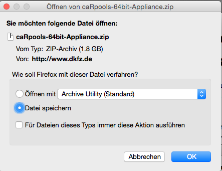
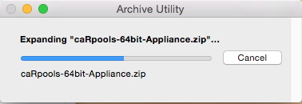
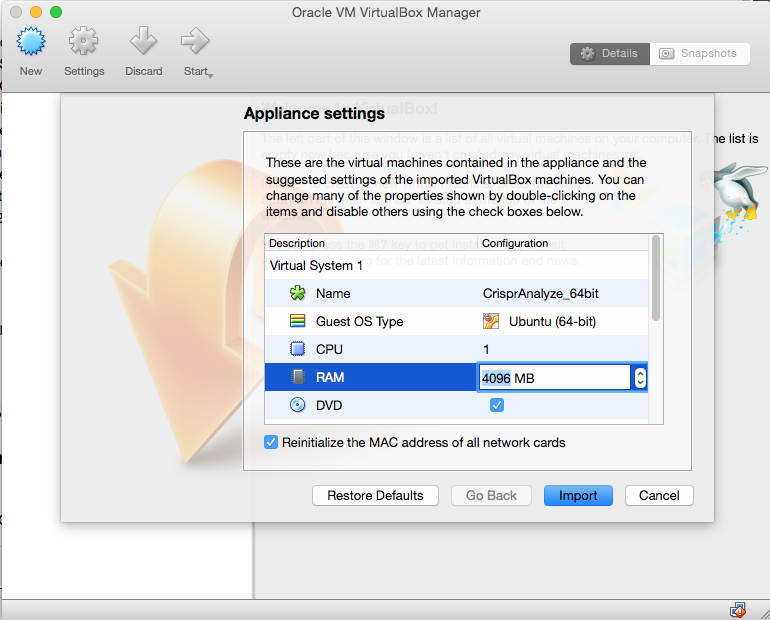
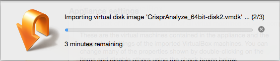
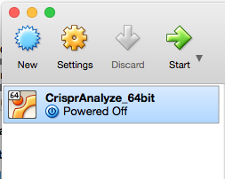
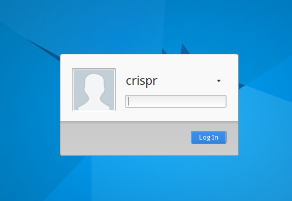
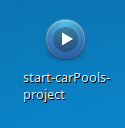
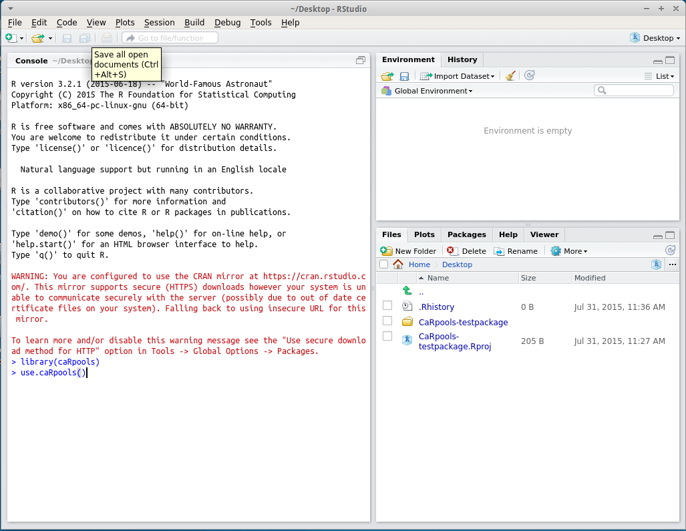

---
output:
  html_document: default
---
# Installing caRpools Virtual Appliance Image

In this tutorial we will show you how to install and configure the caRpools virtual appliance into the open-source virtualization software VirtualBox. CaRpools is delivered using the ovf format which can also be used by other virtualization products such as Parallels or VMWare.
 
* First install the latest VirtualBox version 5 from [here](https://www.virtualbox.org)

* Now download the official __caRpools virtual appliance__ from [here](http://www.dkfz.de/signaling/caRpools/caRpools-64bit-Appliance.zip) (1.9 GB)  



* extract the downloaded file caRpools-64bit-Appliance.zip (by double-clicking on the icon)

```bash
MD5 Hash of caRpools-64bit-Appliance.zip: 40ef681fabc1ca6c7bf5548094836bb2  		
```


* The extracted file will be called caRpools-64bit-Appliance.ova, double-click on it to start the import into VirtualBox
* Next you will be asked to configure your virtual machine. Leave everything standard other than the RAM. Here you should provide a number which should be roughly 50% to 75% of your systems available RAM. So if you have 8GB RAM I would go for 4GB to a maximum of 6GB of RAM. The more RAM the better but if it is too much your host system can get really slow and unresponsive. Also tick the "Reinitalize the MAC address of all network cards here". When finished click on "Import".



* The actual import will take some time, please be patient.



* when it has finished select the virtual machine in the main menu and click on the Start button



* after the virtual machine has loaded login the system using **username: crispr**, **password: cas**. 


* Finished!  The system will automatically load RStudio where you can start to work on caRpools

### Make a test run
Having started RStudio it should automatically load the CaRpools-testpackage project. If this is not the case, please double-click on the icon called **start-CaRpools-project** on your desktop.



Now type in the following commands into the console to run the test

```R
library(caRpools)
use.caRpools()
```



Depending on your host computer and amount of RAM you declared for this virtual machine the analysis will take some time, so please be patient.
The final result will be a PDF file called CaRpools-extended-PDF.pdf in the folder desktop/CarPools-testpackage.

## Applying your own Data

You can of course use your own data, the caRpools testpackage is just meant as a start so you can make sure everything is already setup to work.  
Just follow these steps:  

* Copy your data files (see CaRpools-MANUAL.pdf for further information) to the __data__ folder
* Copy the MIACCS.xls to your computer and edit the file as described in the CaRpools Manual or the __CaRPools-UserGuide-MIACCS.pdf__
* After editing the MIACCS file with all necessary information, please make sure both filenames and folder paths are correct
* For the standard extended PDF report start CaRpools with `use.caRpools()`
* In case you want the other reports, `use.caRpools(file="TEMPLATE.Rmd")` with the other provided templates, that are _CaRpools-extended-HTML.Rmd_ (extended HTML version), _CaRpools-PDF.Rmd_ or _CaRpools-HTML.Rmd_ (both standard versions)

### How to copy data from and to the virtual machine?
* starting with Virtualbox 5 dragging and dropping files from the virtual desktop to your local desktop and vice versa is supported.
* To enable it on your machine you have to go to Virtualbox menu ->Device ->Drag and Drop->tick Bidirectional


